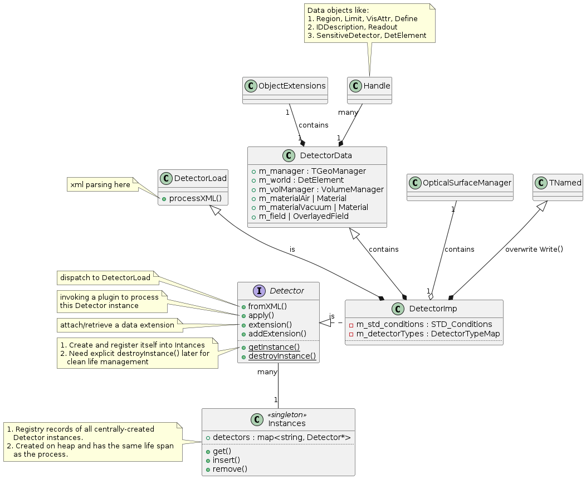
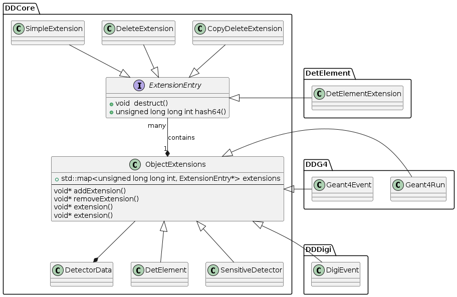

====================
Dive into ``DD4hep``
====================

    :Author: yong

.. contents::


1 DDCore
--------

1.1 ``Detector``
~~~~~~~~~~~~~~~~

``Detector`` class is the entry point to use geometry management features in DD4hep.
It provides the interface that the client needed to use the detector geometry.
Other features in DD4hep are built around ``Detector`` building, updating and using.

Geometry tree hierarchy is built upon ``TGeo`` package from ROOT, but convertible to Geant4 geometry with ``DDG4``.
A second logical ``DetElement`` tree hierarchy is associated with the primary geometry tree.
``DetElement`` node is directly attached to a geometry node, but not to replicate all levels of the tree.
``Detector`` can be converted to Geant4 geometry model for simulation internally.

The main persistency format is xml, but native ROOT TGeo geometry and GDML geometry are supported as well.
CAD model can be imported into geometry tree with ``DDCAD``.

1.1.1 design
^^^^^^^^^^^^

``Detector`` is an interface class (abstract), the only implementation [1]_  is ``DetectorImp``.

``DetectorImp`` has a clear separation of inernal components using C++ multi-inheritance.
``Detector`` as interface for client to use, ``DetectorData`` as internal data storage and ``DetectorLoad`` to parse xml.
``DetectorImp`` also inherits from ``TNamed``, thus has ROOT I/O support (a default constructor needed).
``DetectorImp`` is neither copiable nor movable.

Each ``DetectorImp`` instance has its own ``TGeoManager``, which becomes ``gGeoManager`` immediately
after creation (or there is only one ``DetectorImp`` instance in the system).
Alternatively, its ``TGeoManager`` can be accessed on instance basis using:

.. code:: c++

    virtual TGeoManager& manager() const

1.1.2 access ``Detector`` instance
^^^^^^^^^^^^^^^^^^^^^^^^^^^^^^^^^^

``Detector`` objects can be centrally managed, or self-managed:

.. code:: c++

    //1. central-managed, native
    static Detector& Detector::getInstance(const std::string& name="default");
    static void Detector::destroyInstance(const std::string& name="default");
    // central-managed, plugin
    dd4hep::PluginService::Create<void*>("Detector_constructor",name);
    // 2. self-managed
    static std::unique_ptr<Detector> Detector::make_unique(const std::string& name);

Both acess methods are thread-safe, with protection of lock/mutex.
Multiple instances are allowed by using ``name`` as the key identifier, but only the 'default' instance is used in DD4hep.
Self-managed ``Detector`` usage in not used DD4hep.
The plugin method seems to be the recommended method by the author, see `ddhep\_instance() <~/src/physics/key4hep/DD4hep/UtilityApps/src/run_plugin.h>`_.

Central-managed ``Detector`` instances are registered by ```Intances`` <~/src/physics/key4hep/DD4hep/DDCore/src/DetectorImp.cpp>`_ class in anonymous namespace [2]_  in ``DetectorImp.cpp``.
Classes defined in anonymous (a.k.a. unamed) namespace is only visible to objects in the same source file,
meaning it's the private registration book of ``DetectorImp`` objects, and the only interface for editing is
through static method ``DetectorImp::getInstance()/destroyInstance``.
It's a singleton, accessed by:

.. code:: c++

    Instances& detector_instances()

``Intances`` is an internal stuff, end users need worry about it.

Self-managed instance automatically life management (``std::unique_ptr`` underneath).
**Caution:** centrally-managed instances are not owned by the ``Intances`` singleton, they need explicit life management.
They should be destroyed explicitly in the using process with ``static Detector::destroyInstance()`` to have a controlled
resource releasing.

**Caution:** ``Detector`` instances are not DD4hep ``Handle`` either (see `sec:object_model`_ ),
but it owns a lot of ``Handle`` through ``DetectorData``.

1.1.3 ``compact`` xml parsing
^^^^^^^^^^^^^^^^^^^^^^^^^^^^^

``compact`` is a hitoric name referring to the xml structure used to build ``Detector``.
It's deprecated now, but still widely used in code structure nameing and documentation.

``DetectorLoad`` provieds methods to xml files internally.
``DetectorImp`` inherits from it and expose the loading as interface method:

.. code:: c++

    virtual void fromXML(const std::string& fname, DetectorBuildType type = BUILD_DEFAULT)
    // or, deprecated
    virtual void fromCompact(const std::string& fname, DetectorBuildType type = BUILD_DEFAULT)

The real job is processed in ``DetectorLoad::processXMLElement``, which uses plugin mechanism to
create the xml reader defined in `Compact2Objects.cpp <~/src/physics/key4hep/DD4hep/DDCore/src/plugins/Compact2Objects.cpp>`_ to process root node:

.. code:: c++

    // create root node reader and convert
    long result = PluginService::Create<long>(type, m_detDesc, &handle);
    // for <lccdd> root tag, [to be deprecated]
    DECLARE_XML_DOC_READER(lccdd,load_Compact)
    // for <xml> root tag
    DECLARE_XML_DOC_READER(compact,load_Compact)

1.1.3.1 top-level tags and parsing sequence
:::::::::::::::::::::::::::::::::::::::::::

Root tag is *lccdd* or *compact*.
Top-level tags under root node are associated with a predefined ``Converter`` (see ``Compact2Objects.cpp``)
These parser defines the basic structure of ``compact`` xml.
The parsing sequence is as following:

.. image:: fig/compact_xml_structure.png

Correct invoking sequence of the converters is needed for tags which may use existing info from previous tags, e.g.
``<detector>`` and ``<sensitivedetector>``.

There're three three states in ``Detector`` instance while building it from xml:

- INVALID

- LOADING

  - ``Detector::init()`` create the ``DetElement`` world volume

- READY

  - ``Detector::endDocument()``

    1. compute box and close TGeo geometry

    2. patching names of anonymous shapes

    3. build a sensitive detector type map (e.g. 'tracker', 'calorimeter', 'compound', 'passive' etc.)

  - now it's ready for usage or post-processing with plugin

1.1.4 persistency
^^^^^^^^^^^^^^^^^

- Import form ``compact`` xml (see `1.1.3 ``compact`` xml parsing`_)

- Import from GDML

  - plugin: ``DD4hepGeometry2GDML`` ``DD4hep_ROOTGDMLExtract`` ``DD4hep_ROOTGDMLParse``

- Import ``TGeoManager`` from ROOT file

  - plugin: ``DD4hep_PlainROOT``

  - file: `~/src/physics/key4hep/DD4hep/DDCore/src/gdml/ImportPlainRoot.cpp <~/src/physics/key4hep/DD4hep/DDCore/src/gdml/ImportPlainRoot.cpp>`_

- Save `DD4hepRootPersistency <~/src/physics/key4hep/DD4hep/DDCore/src/DD4hepRootPersistency.cpp>`_

  - Plugin: ``DD4hep_Geometry2ROOT`` and ``DD4hep_RootLoader``

  - The save object is ``DD4hepRootPersistency``, because:

    1. ``Segmentation`` can't be saved directly

    2. to save alignment conditions

- Save ``DetectorImp`` directly

  - overriding ``TNamed::Write()``

  - not available in ``Detector`` interface

- Save to GDML

**Note** Geometry model import from gdml and TGeoManager need verification that full features as ``compact`` xml

1.1.5 design
^^^^^^^^^^^^

- clea



1.2 post-processor plugins
~~~~~~~~~~~~~~~~~~~~~~~~~~

After loading and building the geometry from xml, post-processing of the geometry is possible using plugins.
``<plugin>`` tag is used for this purpose.
Plugins which are callable from xml is defined by the macro:

.. code:: c++

    //
    #define DECLARE_APPLY(name,func)
    // func type, first arg is current detector description
    long(dd4hep::Detector& l,int n,char** a)

These plugins are built upon the plugin framework of DD4hep (details on Sec. `sec:plugin_framework`_
They are totally user-customizable and their usage is very flexible.
In DD4hep, they are used:

1. as post-processor during xml parsing

   - the last step of DOM parsing, after building other ``Detector`` components

   - imposing on the detector description just composed from xml

   - dispatch the plugin creation and invoking to ``Detector::apply(const char* factory, int argc, char** argv)``

2. as the core of an independent application, demos are:

   - ```teveDisplay`` <~/src/physics/key4hep/DD4hep/UtilityApps/src/teve_display.cpp>`_ using ``int main_default(const char* name, int argc, char** argv)``

   - ```geoWebDisplay`` <~/src/physics/key4hep/DD4hep/UtilityApps/src/webdisplay.cpp>`_ and ```geoDisplay`` <~/src/physics/key4hep/DD4hep/UtilityApps/src/display.cpp>`_ using ``int main_plugins(const char* name, int argc, char** argv)``

   - ```geoConverter`` <~/src/physics/key4hep/DD4hep/UtilityApps/src/converter.cpp>`_ using ``long run_plugin(dd4hep::Detector& description, const char* name, int argc, char** argv``

3. as customizable parameter of general plugin running environment

   - ```geoPluginRun`` <~/src/physics/key4hep/DD4hep/UtilityApps/src/plugin_runner.cpp>`_ using ``int invoke_plugin_runner(const char* name, int argc,char** argv)``

Both step 2 and 3 need an detector xml file as a command line argument.
The xml file specify the detector geometry to be processed by the plugin.

[todo] List of useful post-processor:

1.3 Readout
~~~~~~~~~~~

1.3.1 Segmentation
^^^^^^^^^^^^^^^^^^

1.3.2 ID Decoder/Encoder
^^^^^^^^^^^^^^^^^^^^^^^^

1.4 DetElement and SensitiveDetector
~~~~~~~~~~~~~~~~~~~~~~~~~~~~~~~~~~~~

``DetElemen`` acts as a data concentrator of all data  associated with a detector component, e.g.
geometrical dimensions, the alignment and calibration constants 
and other slow varying conditions such as the gas pressure, end-plate 
temperatures

``DetElement`` is associated with placement or leaf of the physical geometry tree.
individual placement must be identified by their full path from mother 
to daughter starting from the top-level volume. 
Thus, the relationship between the Detector Element and the placements
is not defined by a single reference to the placement, but the full path 
from the top of the detector geometry model to resolve existing
ambiguities due to the reuse of :math:`Logical` :math:`Volumes`.


The tree structure of ``DetElement`` is a parallel structure to the physical geometrical hierarchy.
This structure will probably not be as deep as the geometrical one since 
there would not need to associate detector information at very fine-grain.
The tree of Detector Elements is fully degenerate and each detector element object will be placed only
once in the detector element tree. In contrary, a TGeoNode is placed once in its mother volume, but the
mother volume may be multiple times, thus placed multiple times in the end.

.. _sec:detelement_types:

1.4.1 category of detector element
^^^^^^^^^^^^^^^^^^^^^^^^^^^^^^^^^^

Detector elements are categorized into 4 pre-defined groups:

- *tracker*

- *calorimeter*

- *compound*

- *passive*

1.5 Volume
~~~~~~~~~~

1.5.1 VolumeManager
^^^^^^^^^^^^^^^^^^^

- create volumeID of DetElement

  - have to instatiate it using ``Detector`` descriptin once to make sure volID is generated

1.6 Surface
~~~~~~~~~~~

1.6.1 Overview
^^^^^^^^^^^^^^

'Surface' in ``DD4hep`` normally is associated with a measurement surface of a detector element, but can be used
for any purposes (e.g. passive material like beam pipe).

Surface is attached/associated with a geometry volume.

All surface related features are in ``DDRec`` package.
Interface class ``ISurface`` provides the access interface of using surface for the client:

.. table:: List of interface methods of ``ISurface``
    :name: tbl:surface_inerface

    +--------------------------+------------------------------------------------------------------------------------------------------+
    | Method                   | Decription                                                                                           |
    +==========================+======================================================================================================+
    | *type()*                 | properties of the surface                                                                            |
    +--------------------------+------------------------------------------------------------------------------------------------------+
    | *id()*                   | same as DetElement id or volID or cellID                                                             |
    +--------------------------+------------------------------------------------------------------------------------------------------+
    | *u()*, *v()*             | the two unit vector along the two measurement direction on the surface                               |
    +--------------------------+------------------------------------------------------------------------------------------------------+
    | *origin()*               | origin unit vector of the surface measurement coordinate system                                      |
    +--------------------------+------------------------------------------------------------------------------------------------------+
    | *normal()*               | unit vector along the normal direction of the surface, usually point out of the sensitive area       |
    +--------------------------+------------------------------------------------------------------------------------------------------+
    | *length\_along\_u()/v()* | the length of the surface along *u* or *v*, can be used for boundary checking of regular shape       |
    +--------------------------+------------------------------------------------------------------------------------------------------+
    | *insideBounds()*         | default condition: on surface with a tolerance and inside shape, customizable                        |
    +--------------------------+------------------------------------------------------------------------------------------------------+
    | *distance()*             | distance to the surface, used to judge on surface or not,default is perpenticular line, customizable |
    +--------------------------+------------------------------------------------------------------------------------------------------+
    | *globalToLocal()*        | 3d global coordinates to 2d *(u,v)* coordinates with *o* as origin                                   |
    +--------------------------+------------------------------------------------------------------------------------------------------+
    | *localToGlobal()*        | reverse of *globalToLocal()*                                                                         |
    +--------------------------+------------------------------------------------------------------------------------------------------+
    | *getLines()*             | for drawing the surface (used in *teveDisplay* to show the attached surface)                         |
    +--------------------------+------------------------------------------------------------------------------------------------------+
    | *inner/outerThickness()* | thickness along normal and minus-normal direction of the surface                                     |
    +--------------------------+------------------------------------------------------------------------------------------------------+
    | *inner/outerMaterial()*  | material type on the inside/outside of the surface                                                   |
    +--------------------------+------------------------------------------------------------------------------------------------------+

.. notes::

    Note that although surface id is ``DetElement`` id, but multiple surfaces can be attached to the same ``DetElement``.
    Thus it's a multimap (see Sec. `sec:surface_management`_ for details).

1.6.2 data classes
^^^^^^^^^^^^^^^^^^

The implementation distinguishes the concept of logical surface and physical surface by two subclass from ``ISurface``:

``VolSurface``
    a logical entity, which provides

    - the association with a logical volume

    - *u*,/v/,/n/,/o/ vectors in the associated volume's coordinate system

    - fake (just in the local coordinate system) transform: *localToGobal* and *globalToLocal*

    - in bottom, it acts a shared\_ptr style resource handle to ``VolSurfaceBase`` which

      - ``VolSurfaceBase`` is the real data object underneath

    - some setters in addition to ``ISurface`` interfaces

    - custom implementation may be provided for special volumes by inheriting from ``VolSurface``

    - using local coordinates as argument

    - this is the interface client uses to define a surface in detector construction

``Surface``
    represents a placed surface, which provides

    - the association with a ``DetElement`` (since detector element is fully degenerated tree)

    - use world transformation of ``DetElement`` to define the real position of the physical surface

    - *u*, *v*, *n*, *o* vectors in the world coordinate system

    - real coordinate system transform: *localToGlobal* and *globalToLocal*

    - custom implementation may be provided for special surfaces by inheriting from ``VolSurface``

    - it's a usage class without setter

    - using global coordinates as argument

    - this is the interface client uses for reconstruction purposes

Two list of the above two types of ``ISurface`` implementation:

- ``VolSurfaceList``

  - contained ``VolSurface`` is reference counted

- ``SurfaceList``

  - owner of the contained ``Surface``

Both inherit from ``std::list`` of surface pointers for efficient insert/splice.
Both are attach to the ``DetElement`` as a data object extension (for object extension, see Sec. `sec:extension`_).

List of predefined surface shapes:

.. table::

    +----------+------------------------+------------------------------------+-------------------------------+
    | shape    | ``VolSurfaceBase``     | ``VolSurface``                     | description                   |
    +==========+========================+====================================+===============================+
    | Plane    | ``VolPlaneImpl``       | ``VolSurfaceHandle<VolPlaneImpl>`` | flat plane, moest common type |
    +----------+------------------------+------------------------------------+-------------------------------+
    | Cone     | ``VolConeImpl``        | ``VolCone``                        | \                             |
    +----------+------------------------+------------------------------------+-------------------------------+
    | Cylinder | ``VolCylinderImpl``    | ``VolCylinder``                    | no z constraint               |
    +----------+------------------------+------------------------------------+-------------------------------+
    | Cylinder | ``SimpleCylinderImpl`` | ``SimpleCylinder``                 | add z length constraint       |
    +----------+------------------------+------------------------------------+-------------------------------+

List of pre-defined implementation of ``VolSurface``, they are defined mainly to
hide the dynamic allocation of the underlying ``VolSurfaceBase`` object (AKA ``value semantic``):

- ``VolSurfaceHandle<T>``

  - type argument is of type ``VolSurfaceBase``

  - ``VolPlane`` as a demo: ``typedef VolSurfaceHandle< VolPlaneImpl > VolPlane``

  - limitation: the constructor signature is limited

- ``VolCone``

  - for Cone style surface with special constructor arguments

- ``VolCylinder``

  - for Cylinder style surface with special constructor arguments

- ``SimpleCylinder``

  - a customized cylider surface implementation defined for beam pipe

  - defined in ``DDDetectors``

List of pre-defined physical surface class:

- ``Surface``

- ``CylinderSurface``

- ``ConeSurface``

.. _sec:surface_management:

1.6.3 management classes
^^^^^^^^^^^^^^^^^^^^^^^^

There are three levels of management (as a class) defined:

- ``DetectorSurfaces``

  - subclass of ``DetElement``

  - create the ``SurfaceList`` object extension

  - create a list of ``Surface`` from the ``DetElement``'s ``VolSurfaceList`` and put them into the ``SurfaceList`` extension

  - this ``SurfaceList`` is the owner of the contained ``Surface``

  - acts on the same level of geometry tree, no transversal into daughter level

- ``SurfaceHelper``

  - usually acts on a top-level subdetector element (no constraint on using it in any level of geometry tree)

  - scan through current and all lower levels of the geometry tree

  - uses ``DetectorSurfaces`` internally to create ``SurfaceList`` for each ``DetElement`` on the lower level

  - collect all ``Surface`` in this process and stores a copy of them in a ``SurfaceList`` data member

  - this ``SurfaceList`` is not the owner of contained ``Surface``, just a view

- ``SurfaceManager``

  - acts on the detector descriptin level (aka world-level)

  - loop through all top-level subdetectors

  - in this processs

    - uses ``SurfaceHelper`` to create surfaces for each subdetector

    - and collect a copy of all surfaces and categorize them according to subdetector name, detector type name
      and 'world'

    - the entry in each category is a ``std::multimap`` with surface id as key and pointer to ``Surface`` as value

  - these surface maps are not owner of contained ``Surface``, just a view

  - it is created with ``InstallSurfaceManager`` plugin, usually embed in the ``compact`` xml as a post-processor [3]_ .

    - ``SurfaceManager`` is installed as a data extension of ``Detector``

.. image:: fig/surface_categories.png

1.6.4 add surface
^^^^^^^^^^^^^^^^^

Adding surface into detector geometry is simple:

1. create ``VolSurface``

2. add it to a ``DetElement``

3. instantiate a ``SurfaceManager``

Method 1:
in the detector construction plugin source:

.. code:: c++

    DetElement aDE( motherDE, names, id);
    aDE.setPlacement(pv) ;
    // define the DetElement and a VolSurface yon need, here is flat plane
    VolPlane surf(...)
    // use helper function to add it to the associated DetElement's VolSurfaceList
    volSurfaceList(aDE)->push_back(surf) ;

Then, in the ``compact`` xml, add a post-processor plugin:

.. code:: xml

    <plugins>
       <plugin name="InstallSurfaceManager"/>
    </plugins>

``IntallSurfaceManager`` is needed to create a ``SurfaceManager`` instance, which in turn scan through the geometry
tree and create the surfaces and put them into corresponding maps in the meantime.

Method 2:
alternatively, ``DD4hep`` provides an API to define a post-processor plugin to add ``VolSurface`` after the geometry
tree is closed. The API is defined in ``SurfaceInstaller.cpp`` source file in ``DDCore`` package and aims to add
surfaces to a top-level sub-detector automatically.
Since it's a plugin, user can choose to add ``VolSurface`` into the geometry or not by toggling the plugin.

An demo usage is as following, in the plugin source file:

.. code:: c++

    // 1. an optional data struct to hold xml parameters of this plugin
    namespace {
      struct UserData {
        int dimension ; // measurement dimension, 1 or 2
        double uvector[3]; // one of the measurement direction unit
        double vvector[3]; // the other one
      };
    }

    // 2. the API requested macros
    #define SURFACEINSTALLER_DATA UserData
    #define DD4HEP_USE_SURFACEINSTALL_HELPER DD4hep_GenericSurfaceInstallerPlugin // name of the plugin

    // 3. include the API header
    #include "DD4hep/SurfaceInstaller.h"

    // 4. optionally overwrite the function to handl xml parameters, to be stored in UserData
    template <> void Installer<UserData>::handle_arguments(int argc, char** argv)   {
      // parse argc and argv directly, they are correctly fetched from xml by the API
      // ...
    }

    // 5. optionally overwrite the function to create VolSurface.
    //    It's invoked for each ~DetElement~ of the subdetector
    template <typename UserData>
    void Installer<UserData>::install(dd4hep::DetElement component, dd4hep::PlacedVolume pv)   {
      // component: a detector element; pv: the placeVolume of this detector element

      // ...

      // define the VolSurface as usual
      VolPlane surf(comp_vol, type, inner_thickness, outer_thickness, u, v, n, o);

      // attach the VolSurface (Caveat: not with volSurfaceList())
      addSurface(component,surf);

      // optional stop scanning the hierarchy any further, only process the top-level element
      stopScanning() ;
    }

Then, add this plugin in the ``compact`` xml:

.. code:: xml

    <!-- name is existing subdetector name -->
    <plugins>
      <plugin name="DD4hep_GenericSurfaceInstallerPlugin">
        <!-- argument is pased to handle_arguments() -->
        <argument value="OuterTrackerBarrel"/>
        <argument value="dimension=2"/>
        <argument value="u_x=1."/>
        <argument value="v_y=1."/>
        <argument value="n_z=1."/>
      </plugin>

      <!-- still needed to actually create Surfaces -->
      <plugin name="InstallSurfaceManager"/>
    </plugins>

Usually, ``SurfaceInstaller`` is customized to install surfaces for sensitive detector elements automatically.
Predefined installers defined in ``DDDetectors`` are:

.. table::

    +----------------------------------------------------+------------------------------------------------------------------------+
    | plugin name                                        | feature                                                                |
    +====================================================+========================================================================+
    | ``DD4hep_GenericSurfaceInstallerPlugin``           | create plane surface for sensitive box shape, u,v,n,o configuration    |
    +----------------------------------------------------+------------------------------------------------------------------------+
    | ``DD4hep_SiTrackerBarrelSurfacePlugin``            | same as above, but more constraint u,v,n,o                             |
    +----------------------------------------------------+------------------------------------------------------------------------+
    | ``DD4hep_SiTrackerEndcapSurfacePlugin``            | trapezoid sensitive shape                                              |
    +----------------------------------------------------+------------------------------------------------------------------------+
    | ``DD4hep_PolyhedraEndcapCalorimeterSurfacePlugin`` | polyhedra sensitive shape                                              |
    +----------------------------------------------------+------------------------------------------------------------------------+
    | ``DD4hep_CaloFaceBarrelSurfacePlugin``             | barrel box shape, not sensitive-related, a single plane for each slice |
    +----------------------------------------------------+------------------------------------------------------------------------+
    | ``DD4hep_CaloFaceEndcapSurfacePlugin``             | two mono-block polyhedron for each endcap, not sensitive-related       |
    +----------------------------------------------------+------------------------------------------------------------------------+

1.6.5 use surface
^^^^^^^^^^^^^^^^^

Method 1:
cellID-based using ``SurfaceManager`` interface

.. code:: c++

    // SurfaceManager instance is an extension object of dectector descriptin
    Detector& description = context()->detectorDescription();
    SurfaceManager& surfMan = *description.extension< SurfaceManager >() ;

    // Get the category of surface map
    const SurfaceMap& surfMap = *surfMan.map( "world" ) ;

    // cellID is from hit, use it to find the surface
    SurfaceMap::const_iterator si = surfMap.find(hit->cellID);
    ISurface* surf = (si != surfMap.end() ?  si->second  : 0);

    // use any method you need
    double dist = surf->distance(hit_point)/dd4hep::mm;
    auto isInside=surf->insideBounds(hit_point)

Method 2:
``DetElement``-based

.. code:: c++

    // method one:
    // use a target detector element to create the helper
    SurfaceHelper surfMan(det) ;
    // fetch and loop through the surface list
    const SurfaceList& sL = surfMan.surfaceList() ;
    for( SurfaceList::const_iterator it = sL.begin() ; it != sL.end() ; ++it ){
      // ...
     }

    // method two:
    // just fetch the surface list directly from detector element
    SurfaceList* sL = det.extension<SurfaceList>();

1.6.6 class diagram
^^^^^^^^^^^^^^^^^^^

.. image:: fig/surface_class.png

1.7 Field
~~~~~~~~~

OverlayedField

1.8 Material
~~~~~~~~~~~~

1.9 Visualization/Drawing
~~~~~~~~~~~~~~~~~~~~~~~~~

1.9.1 Native method
^^^^^^^^^^^^^^^^^^^

``DetectorImp`` owns a ``TGeoManager``, which can be draw by ```DetectorImp::dump`` <~/src/physics/key4hep/DD4hep/DDCore/src/DetectorImp.cpp>`_

.. code:: c++

    // ROOT macro
    gSystem->Load("libDDCore.so");
    auto& detdesc=dd4hep::Detector::getInstance()
    detdesc.fromXML("YourDetector.xml")
    detdesc.dump()

1.9.2 Utility apps
^^^^^^^^^^^^^^^^^^

- geoWebDisplay

- geoDisplay

- teveDisplay

- ddev

1.10 Apps
~~~~~~~~~

[[

.. table::

    +------------------+-----------------------------------------------------------------------------------+
    | executable       | features                                                                          |
    +------------------+-----------------------------------------------------------------------------------+
    | ``dumpdetector`` | print out: xml header, detector type, detector data, sensitive detector, surfaces |
    +------------------+-----------------------------------------------------------------------------------+
    | \                | \                                                                                 |
    +------------------+-----------------------------------------------------------------------------------+

1.11 Other Data Structures
~~~~~~~~~~~~~~~~~~~~~~~~~~

1.11.1 Condition data
^^^^^^^^^^^^^^^^^^^^^

``OpaqueData``

1.11.2 Alignment data
^^^^^^^^^^^^^^^^^^^^^

2 DDG4
------

2.1 Kernel Access
~~~~~~~~~~~~~~~~~

Master Kernel is a singleton:

.. code:: c++

    // master kernel constructor in public:
    Geant4Kernel(Detector& description)
    // singleton access, global scope
    static Geant4Kernel& instance(Detector& description);
    // from worker's scope
    Geant4Kernel& master()  const  { return *m_master; }

The master constructor is in ``public`` scope, but only ``instance()`` method is used as access interface.
Maybe, it's a good idea to put master constructor in ``protected`` scope.

Worker constructor in in ``protected`` scope, not directly accessible to clients.
Instead, kernel can only be created & accessed through the master kernel:

.. code:: c++

    // worker constructor is protected. m is master, identifier should be thread id
    Geant4Kernel(Geant4Kernel* m, unsigned long identifier);
    // create, use thread id by default
    virtual Geant4Kernel& createWorker();
    // access , flag is to control creation if not exist
    Geant4Kernel& worker(unsigned long thread_identifier, bool create_if=false);
    // identifier is system thread id
    static unsigned long int thread_self();
    // usage example
    Geant4Kernel&  krnl = kernel().worker(Geant4Kernel::thread_self(),true);

Example application:

- Customized Python interpreter

  - pyddg4.cpp : the executable

  - PyDDG4.cpp : the kernel usage

- Python binding:

  - `DDG4.Kernel is KernelHandle <~/src/physics/key4hep/DD4hep/DDG4/python/DDG4.py>`_ defined in `Geant4Handle.h <~/src/physics/key4hep/DD4hep/DDG4/include/DDG4/Geant4Handle.h>`_

  - Each KernelHandle instance points to the master kernel

- standalone exectutable demo: g4FromXML.cpp

2.2 Multi-Threading
~~~~~~~~~~~~~~~~~~~

DDG4's threading context is built upon Geant4's MT running environment.

Controlled by:

- NumberOfThreads property (in python script)

Demo application:

- /home/yong/src/physics/key4hep/DD4hep/DDG4/examples/SiDSim\_MT.py

3 DDAlign
---------

3.1 Alignment procedure
~~~~~~~~~~~~~~~~~~~~~~~

1. ideal geometry: from design, the start point

2. actual geometry (called global aligenment in dd4hep): after installation, from survey

3. realignment (called local alignment in dd4hep): caused by environment or aging, small deltas,
   from calibration/data analysis

Alignment parameters may be applied to any volume 
of the ideal geometry. The alignment only affects the actual position of 
a volume it is e.g. irrelevant if the volume is sensitive or not.


(re-)align a volume in the hierarchy means to logically lift a full branch of placements
from the top volume down to the element to be (re-)aligned out of this shared hierarchy and apply
a correction matrix to the last node.


In general any deviation from the ideal position of a volume
can be described by :math:`T = L * P * R * P^{-1}`, where

- :math:`T` is the full transformation in 3D space containing the change to the

exiting placement transformation. The existing placement is the placement
transformation of the volume with respect to the mother volume.

- :math:`L` is a translation specifying the position change with respect to the
  mother volume.

- :math:`R` is a rotation specifying the position change with respect to the mother volume

- :math:`P * R * P^{-1}` describes a rotation around a pivot point specified 
  int he mother volume's coordinate system.

- :math:`P` is the translation vector from the mother volumes origin to the 
  pivot point. The concept of a pivot point does not introduce a new 
  set of parameters. Pivot points only help to increase the numerical
  precision.

Most of the changes do not require the full set of parameters. Very often 
the changes only require the application of only a translation, only a
rotation or both with a pivot point in the origin.

4 DDDigi
--------

5 DDRec
-------

6 DDCond
--------

7 Utilities
-----------

7.1 Versioning
~~~~~~~~~~~~~~

.. code:: c++

    std::string dd4hep::versionString();

8 Very Bottom Details
---------------------

.. _sec:object_model:

8.1 Object Model of DDCore
~~~~~~~~~~~~~~~~~~~~~~~~~~

``Object`` in DD4hep is an ``concept`` denoting a class of pure data.
The literal 'Object' is sometimes used as template argument name.
It's a logical concept without corresponding class definition, just like a C++20 ``Concept``.
``NamedObject`` is a concrete class, providing named and titled implementation for inheriting ``Object``.

``Handle<NamedObject>`` is a template class acting as the base class to access all named ``Object`` in DD4hep.
It acts as a shared pointer of underlying ``NamedObject``.
No reference counting  [4]_  is added, explicit destroy needed and the ownership is statically defined by the designer.
``Object`` in DD4hep is always passed and handled by a ``Handle``.
``Handle<NamedObject>`` is aliased to ``Ref_t``.
All ``Handle`` managed resources are created on heap, thus having static life span.

By subclassing ``Handle<NamedObject>``, different intefaces may be designed to manipulate underlying data and expoesd
to different clients. This leads to very flexible implementation.
This is a more general feature, not a cons, as seen by the author.

8.1.1 Using ``Handle``
^^^^^^^^^^^^^^^^^^^^^^

Typical usage (``Objects.h`` file provides some simple demos):

1. Define a data class (e.g. named ``CDemoObject``) containing real resources as a subclass of ``NamedObject``

   - 'Object' suffix reflects the fact that the class is a data object

   - they are almost pure aggregation of underlying resources

   - these data classes are considered internal details, thus usually defined in 'XXXIntern.h' (e.g. 'CDemoInterna.h')

2. Define a concrete class inheriting from the object class (e.g. ``CDemo : public Handle<CDemoObject>``)

   - the concrete class acts as the interface to the object class

   - it defines real manipulation of underlying resources

Ownership management:

- create and assign the object class is flexible:

  1. Most use ``new`` operator and then assign in interface handle class's constructor

  2. Some use ``new`` explicitly in normal code and assign, e.g. ``Field`` creation in ``Compact2Objects.cpp``

  3. ``Segmentation`` use ``PluginService::Create<SegmentationObject*>(seg_type, dec)`` in constructor

     - since various segmentation implementation available, a factory pattern is needed

- destroy (a.k.a. the ownership)

  1. member function: ``destroy`` (no use in codebase)

  2. Most owner uses global function: ``destroyHandle()`` and ``destroyHandles()``

Ownership is declared if the owner is in charge of destroying the handle.
It's static and hard-coded.
Most object ownership is solved in ``DetectorData``:

- ``DetectorData`` in the owner of most ``Handle`` directly, i.e. destroy them in destructor

- ``DetElement`` ownership is special in that ``DetectorData`` owns a world ``DetElement``,
  this world in turn owns all its children

- ``Volume`` in the same sense that ``DetectorData`` owns a top ``VolumeManager``, which in turn
  owns all its child Volume. [todo: this is guess, to be verified]

.. image:: fig/object_stratery_classes.png

.. _sec:plugin_framework:

8.2 Plugin Framework
~~~~~~~~~~~~~~~~~~~~

8.2.1 rationale
^^^^^^^^^^^^^^^

- `intall-and-use paradigm <https://tldp.org/HOWTO/HighQuality-Apps-HOWTO/userfriendly.html#installAndUse>`_

- plugin is nothing more that some files in a right format (DLLs that implements the API your Software defined),
  put in the right folders (directories your Software looks for plugins).

- other names: module, component, extension etc.

- ``component oriented programming`` (`from dd4hep Handle.h comment <~/src/physics/key4hep/DD4hep/DDCore/include/DD4hep/Handle.h>`_)

8.2.2 overview
^^^^^^^^^^^^^^

The design of **Plugin Mechanism** is based the idea of ``Factory Pattern``.
The implementation is special in regard of auto-loading the plugin library.

The architecture is identical with Gaudi (core is copied from Gaudi codebase,
check directory ``GaudiPluginService/Gaudi``).
But more wrappings (as pre-defined macros) are added around the core for easy use and modular organization.

All of pre-defined macros to create a new plugin component is listed in ``package/Factories.h``.

Some macros frequently used are [todo]:

.. table::

.. _sec:extension:

8.3 Extension Mechanism
~~~~~~~~~~~~~~~~~~~~~~~

8.3.1 Design
^^^^^^^^^^^^

- Any data class instance can be attachech to ``ObjectExtensions`` deduced class objects (either by inheritance or composing)

- ``ObjectExtensions`` acts as a store by containing a map of extension entries of ``ExtensionEntry``

  - Each ``ObjectExtensions`` instance has its own private store

  - In most cases, it owns the extensions (i.e. in charge of delete)

  - Use type info to generate a key, thus easily using template to generate new entry

    - this means no two entry with same type is allowed in one ``ObjectExtensions`` instance.

    - The interface class type should be used as key generator

- ``ExtensionEntry`` is an interface, which acts as a handle to manage the underlying data extension
  it has multiple subclasses with different ownership policy:

  - ``SimpleExtension`` : no ownership transfer to containing ``ObjectExtensions``

  - ``DeleteExtension`` : with ownership transfer

  - ``CopyDeleteExtension`` : with ownership transfer and copy() as clone

  - ``DetElementExtension`` : same as ``CopyDeletExtension``, but in ``DetElement`` scope only

Usage:

- ``<typename IFACE, typename CONCRETE> IFACE* addExtension(CONCRETE* c)``

  - demo: ``MyClassABC* dex=addExtension<MyClassABC>(ptr_MyClass)``

- ``template <typename IFACE> IFACE* extension()``

  - demo: ``MyClassABC* dex = extension<MyClassABC*>()``

Both return values are pointer to the interface class.

8.3.2 class diagram
^^^^^^^^^^^^^^^^^^^



8.3.3 List of classes with extension support
^^^^^^^^^^^^^^^^^^^^^^^^^^^^^^^^^^^^^^^^^^^^

Classes either inherit from or contains ``ObjectExtensions``:

.. table::

    +------------------+--------+-------------+--------------------+
    | Manager\_Type    | DDCond | inheritance | ownership transfer |
    +==================+========+=============+====================+
    | DetectorData     | DDCore | data member | yes                |
    +------------------+--------+-------------+--------------------+
    | SnsitiveDetector | \      | inheritance | yes                |
    +------------------+--------+-------------+--------------------+
    | DetElement       | \      | inheritance | yes                |
    +------------------+--------+-------------+--------------------+
    | DigiEvent        | DDDigi | inheritance | optional           |
    +------------------+--------+-------------+--------------------+
    | Geant4Run        | DDG4   | inheritance | optional           |
    +------------------+--------+-------------+--------------------+
    | Geant4Event      | \      | inheritance | optional           |
    +------------------+--------+-------------+--------------------+

8.3.4 TODO the internals
^^^^^^^^^^^^^^^^^^^^^^^^

8.3.4.1 main classes
::::::::::::::::::::

.. image:: fig/plugin_mechanism_design1.png

8.3.4.2 thread-safety implementation
::::::::::::::::::::::::::::::::::::

Two ``mutex`` are used in ``Registry``:

- A global one to synchronize singleton creation and access

  - `~/src/physics/key4hep/DD4hep/GaudiPluginService/src/PluginServiceV2.cpp <~/src/physics/key4hep/DD4hep/GaudiPluginService/src/PluginServiceV2.cpp>`_

- A member one in ``Registry`` to synchronize factory entry info registration and access

  - `~/src/physics/key4hep/DD4hep/GaudiPluginService/Gaudi/Details/PluginServiceDetailsV2.h <~/src/physics/key4hep/DD4hep/GaudiPluginService/Gaudi/Details/PluginServiceDetailsV2.h>`_


.. [1] while different implementation is possible, but not necessary. There are hardcoded relations between ``Detector``
    and ``DetectorImp`` like the registration book of ``Detector`` objects in implemented in ``DetectorImp.cpp``.

.. [2] anonymous namespace is a C++ feature to define traslation-unit-local types.
    ``static`` keyword can achieve the same goal for variable declarations, functions and anonymous unions, but not for
    type declaration. (`see this <https://stackoverflow.com/questions/4422507/superiority-of-unnamed-namespace-over-static>`_)

.. [3] Direct usage in C++ code is possible, see `DDMarlinCED in MarlinUtil <~/src/physics/ilcsoft/MarlinUtil/source/src/DDMarlinCED.cc>`_

.. [4] Reference counting is a specialization in some object implementation. No systematic usage in DD4hep except DDG4.
