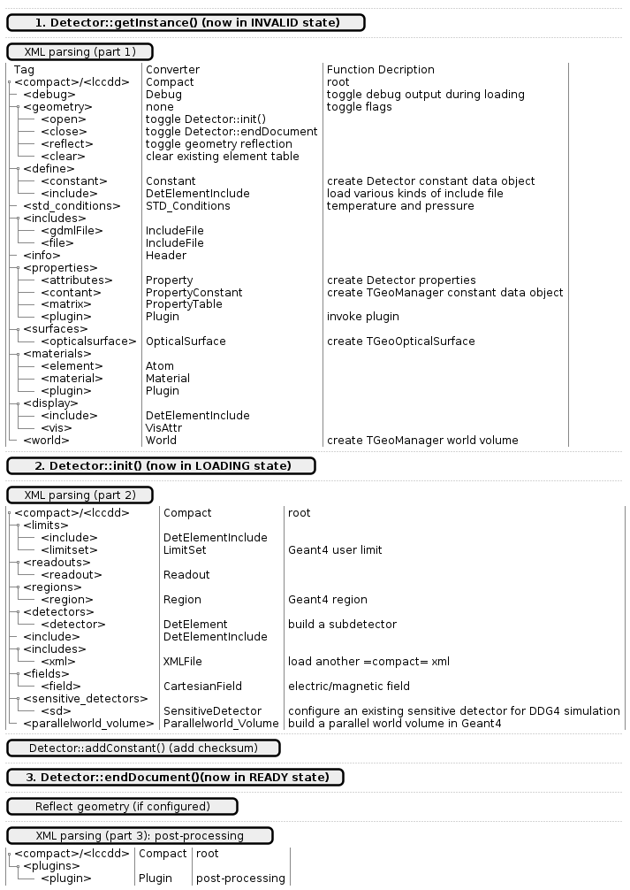
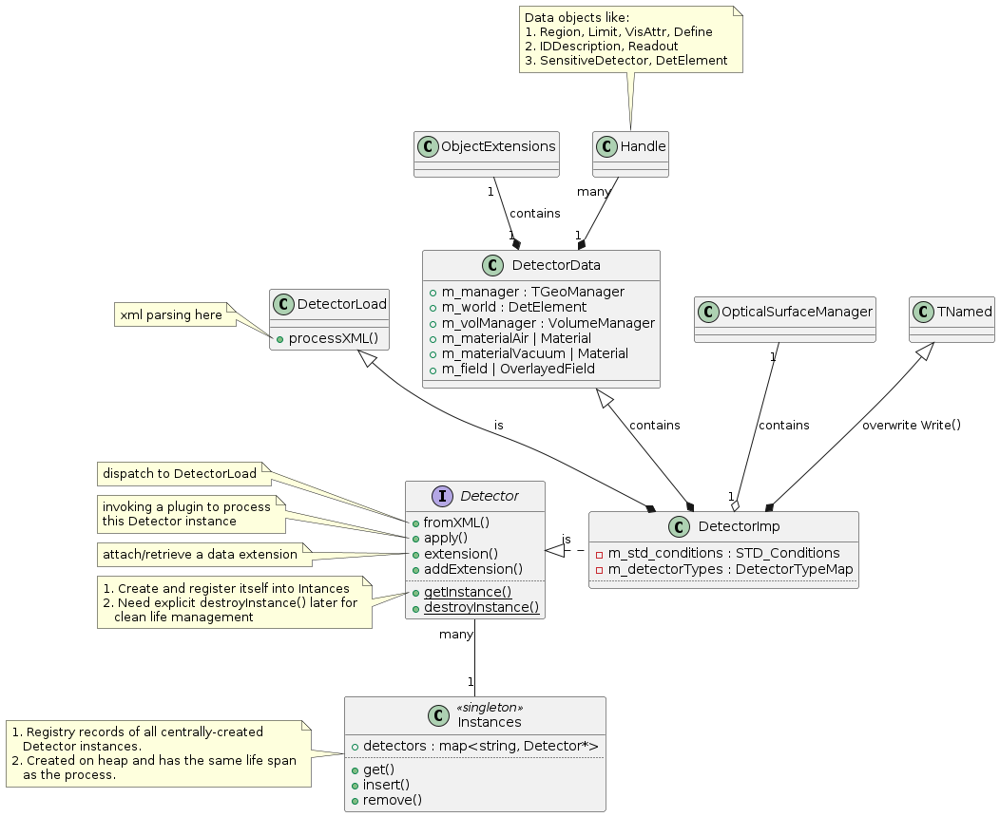
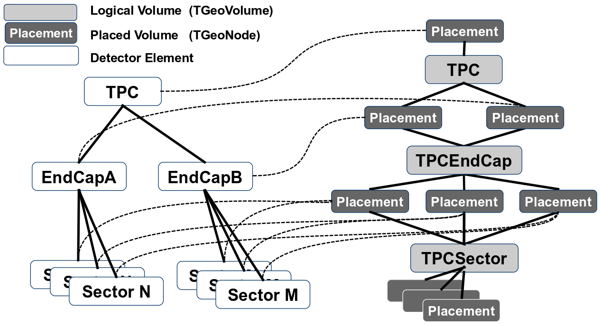
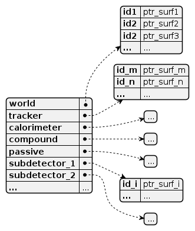
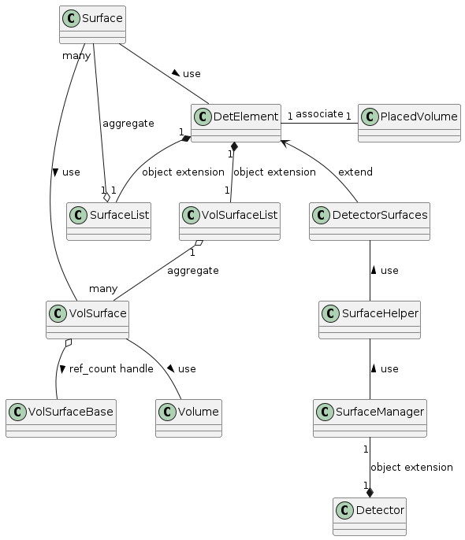
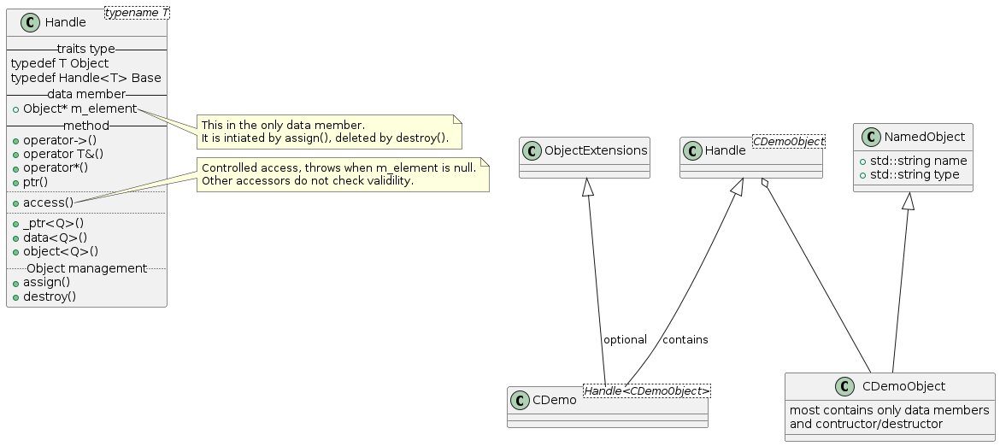
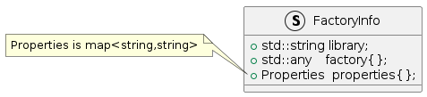

====================
Dive into ``DD4hep``
====================

    :Author: yong

.. contents::


1 Disclaim
----------

This document is meant to be used as a supplement of `the official ``DD4hep`` user manual <https://dd4hep.web.cern.ch/dd4hep/page/users-manual/>`_, hoping to provide
more details on how things are done in ``DD4hep``.
The material presented in this document is from my learning notes, including most diagrams.
Some images are copied from the official user guide and some summaries are from the source comments wherever they
serves better to give an insight into the internal mechanism.
The document does not try to replace or duplicate the content of the official user guide, which gives a better overview.
User should always start from the official user manual and use this as a reference for better using ``DD4hep`` or just
for curiosity about the internal plumbings.

2 DDCore
--------

.. _sec:detector_persistence:

2.1 Detector description
~~~~~~~~~~~~~~~~~~~~~~~~

2.1.1 Overview
^^^^^^^^^^^^^^

Detector description is represented by ``Detector`` class.
This class (the instance of the class, more precisely) is the entry point to build and use geometry in ``DD4hep``.
Other features in DD4hep are built around ``Detector``, like building, updating and using.
``Detector`` only deal with top-level elements (i.e. the subdetector level) in the geometry tree hierarchy.
The geometry manipulation inside each subdetector is dispatched to the ``DetElement`` corresponding to each
subdetector recursively.

Geometry tree hierarchy is built upon ``TGeo`` package from ROOT, but convertible to Geant4 geometry with ``DDG4``.
A second logical ``DetElement`` tree hierarchy is associated with the primary geometry tree.
``DetElement`` node is directly attached to a geometry node, but not to replicate all levels of the tree.
``Detector`` can be converted to Geant4 geometry model for simulation internally.

The main persistency format is xml, but native ROOT TGeo geometry and GDML geometry are supported as well.
CAD model can be imported into geometry tree with ``DDCAD``.

2.1.2 Design
^^^^^^^^^^^^

``Detector`` is an interface class (abstract), the only implementation [1]_  is ``DetectorImp``.

``DetectorImp`` has a clear separation of inernal components using C++ multi-inheritance.
``Detector`` as interface for client to use, ``DetectorData`` as internal data storage and ``DetectorLoad`` to parse xml.
``DetectorImp`` also inherits from ``TNamed``, thus has ROOT I/O support (a default constructor needed).
``DetectorImp`` is neither copiable nor movable.

Each ``DetectorImp`` instance has its own ``TGeoManager``, which becomes ``gGeoManager`` immediately
after creation (or there is only one ``DetectorImp`` instance in the system).
Alternatively, its ``TGeoManager`` can be accessed on instance basis using:

.. code:: c++

    virtual TGeoManager& manager() const

2.1.3 Access ``Detector`` instance
^^^^^^^^^^^^^^^^^^^^^^^^^^^^^^^^^^

``Detector`` objects can be centrally managed, or self-managed:

.. code:: c++

    //1. central-managed, native
    static Detector& Detector::getInstance(const std::string& name="default");
    static void Detector::destroyInstance(const std::string& name="default");
    // central-managed, plugin
    dd4hep::PluginService::Create<void*>("Detector_constructor",name);
    // 2. self-managed
    static std::unique_ptr<Detector> Detector::make_unique(const std::string& name);

Both acess methods are thread-safe, with protection of lock/mutex.
Multiple instances are allowed by using ``name`` as the key identifier, but only the 'default' instance is used in DD4hep.
Self-managed ``Detector`` usage in not used DD4hep.
The plugin method seems to be the recommended method by the author, see `ddhep\_instance() <~/src/physics/key4hep/DD4hep/UtilityApps/src/run_plugin.h>`_.

Central-managed ``Detector`` instances are registered by ```Intances`` <~/src/physics/key4hep/DD4hep/DDCore/src/DetectorImp.cpp>`_ class in anonymous namespace [2]_  in ``DetectorImp.cpp``.
Classes defined in anonymous (a.k.a. unamed) namespace is only visible to objects in the same source file,
meaning it's the private registration book of ``DetectorImp`` objects, and the only interface for editing is
through static method ``DetectorImp::getInstance()/destroyInstance``.
It's a singleton, accessed by:

.. code:: c++

    Instances& detector_instances()

``Intances`` is an internal stuff, end users need worry about it.

Self-managed instance automatically life management (``std::unique_ptr`` underneath).
**Caution:** centrally-managed instances are not owned by the ``Intances`` singleton, they need explicit life management.
They should be destroyed explicitly in the using process with ``static Detector::destroyInstance()`` to have a controlled
resource releasing.

**Caution:** ``Detector`` instances are not DD4hep ``Handle`` either (see `sec:object_model`_ ),
but it owns a lot of ``Handle`` through ``DetectorData``.

2.1.4 Use ``Detector`` instance
^^^^^^^^^^^^^^^^^^^^^^^^^^^^^^^

2.1.4.1 top-level (the level under world) access
::::::::::::::::::::::::::::::::::::::::::::::::

Direct usage:

.. table::

    +-------------------------------------+-----------------------------------------------------------+
    | method                              | function                                                  |
    +=====================================+===========================================================+
    | sensitiveDetector(name)             | get subdetector's SensitiveDetector by its name           |
    +-------------------------------------+-----------------------------------------------------------+
    | sensitiveDetector()                 | get the collection of all subdetectors' SensitiveDetector |
    +-------------------------------------+-----------------------------------------------------------+
    | detector(name)                      | get subdetector's DetElement by its name                  |
    +-------------------------------------+-----------------------------------------------------------+
    | detectors()                         | get the collection of all subdetectors' DetElement        |
    +-------------------------------------+-----------------------------------------------------------+
    | detectors(type1, type2 ...)         | get a set of all subdetectors' DetElement by type         |
    +-------------------------------------+-----------------------------------------------------------+
    | detectors(includeFlag, excludeFlag) | get a set of subdetectors' Detector by type\_flag         |
    +-------------------------------------+-----------------------------------------------------------+
    | detectorTypes()                     | get the available detector types                          |
    +-------------------------------------+-----------------------------------------------------------+

Through helper class ``DetectorHelper``:

.. table::

    +-------------------------+--------------------------------------------------------------------------------+
    | method                  | function                                                                       |
    +=========================+================================================================================+
    | sensitiveDetector(name) | get subdetector's SensitiveDetector by its name                                |
    +-------------------------+--------------------------------------------------------------------------------+
    | sensitiveDetector(de)   | get the SensitiveDetector from a DetElement in the subdetector's geometry tree |
    +-------------------------+--------------------------------------------------------------------------------+
    | detectorID(id)          | get the subdetector's DetElement by system id                                  |
    +-------------------------+--------------------------------------------------------------------------------+
    | element(name)           | get an material element by its name                                            |
    +-------------------------+--------------------------------------------------------------------------------+
    | material(name)          | get a material by its name                                                     |
    +-------------------------+--------------------------------------------------------------------------------+

2.1.4.2 tree tranversal
:::::::::::::::::::::::

Utility functions in namespace ``dd4hep::detail::tools`` (defined in ``DetectorTools.h``):

.. table::

    +-------------------------------------------------------+---------------------------------------------------------------------------------------------+
    | topElement(de)                                        | return the world detector element from any *de* inside tree                                 |
    +-------------------------------------------------------+---------------------------------------------------------------------------------------------+
    | elementPath(de, vector<DetElement>)                   | collect all detector elements in the path from *de* to *world*                              |
    +-------------------------------------------------------+---------------------------------------------------------------------------------------------+
    | elementPath(vector<DetElement>)                       | assemble and return the path based on the collected detector elements                       |
    +-------------------------------------------------------+---------------------------------------------------------------------------------------------+
    | elementPath(de)                                       | same as above but hide details and just return the path string from *world* to *de*         |
    +-------------------------------------------------------+---------------------------------------------------------------------------------------------+
    | findDaughterElement(de\_parent, subpath)              | find and return the detector element according the path string (relative to *de\_parent*)   |
    +-------------------------------------------------------+---------------------------------------------------------------------------------------------+
    | findElement(subpath)                                  | same as above, but relative to *world*                                                      |
    +-------------------------------------------------------+---------------------------------------------------------------------------------------------+
    | isParentElement(de\_parent, de\_child)                | check wether *de\_child* is inside the sub-branch of *de\_parent*                           |
    +-------------------------------------------------------+---------------------------------------------------------------------------------------------+
    | placementPath(de, vector<PlacedVolume>)               | collect all PlacedVolume (no holes) in the path from *de* to *world*                        |
    +-------------------------------------------------------+---------------------------------------------------------------------------------------------+
    | placementPath(de\_parent, de, vector<PlacedVolume>)   | same as above but from *de* to *de\_parent*                                                 |
    +-------------------------------------------------------+---------------------------------------------------------------------------------------------+
    | placementPath(vector<PlacedVolume>)                   | assemble and return the path based on the collected placed volumes                          |
    +-------------------------------------------------------+---------------------------------------------------------------------------------------------+
    | placementPath(de)                                     | same as above, but form *de* to *world*                                                     |
    +-------------------------------------------------------+---------------------------------------------------------------------------------------------+
    | findNode(pl\_vol, path)                               | find a placed volume based on a path relative to *pl\_vol*                                  |
    +-------------------------------------------------------+---------------------------------------------------------------------------------------------+
    | placementTrafo(vector<PlacedVolume>, inverse, matrix) | calculate the transform matrix form the collection of placed volumes found in a path string |
    +-------------------------------------------------------+---------------------------------------------------------------------------------------------+
    | toString(VolIDs ids)                                  | print each fields of *ids*                                                                  |
    +-------------------------------------------------------+---------------------------------------------------------------------------------------------+
    | pathElements(path)                                    | extract all the path elements                                                               |
    +-------------------------------------------------------+---------------------------------------------------------------------------------------------+

Note that placed volume's name pattern is fixed: ``VolumeName_CopyNo`` in which ``VolumeName`` is the name of the placed
``Volume`` and ``CopyNo`` starts from 0.

``GeometryWalk`` class:

2.1.5 ``compact`` xml
^^^^^^^^^^^^^^^^^^^^^

Geometry is defined in ``compact`` xml.
The client needs to specify the constant definitions, material definitions, visAttributes, subdetectors etc.
in ``complact`` geometry.
``compact`` is a hitoric name referring to the xml structure used to build ``Detector``.
It's deprecated now, but still widely used in code structure nameing and documentation.

``DetectorLoad`` provieds methods to xml files internally.
``DetectorImp`` inherits from it and expose the loading as interface method:

.. code:: c++

    virtual void fromXML(const std::string& fname, DetectorBuildType type = BUILD_DEFAULT)
    // or, deprecated
    virtual void fromCompact(const std::string& fname, DetectorBuildType type = BUILD_DEFAULT)

The real job is processed in ``DetectorLoad::processXMLElement``, which uses plugin mechanism to
create the xml reader defined in `Compact2Objects.cpp <~/src/physics/key4hep/DD4hep/DDCore/src/plugins/Compact2Objects.cpp>`_ to process root node:

.. code:: c++

    // create root node reader and convert
    long result = PluginService::Create<long>(type, m_detDesc, &handle);
    // for <lccdd> root tag, [to be deprecated]
    DECLARE_XML_DOC_READER(lccdd,load_Compact)
    // for <xml> root tag
    DECLARE_XML_DOC_READER(compact,load_Compact)

2.1.5.1 top-level tags and parsing sequence
:::::::::::::::::::::::::::::::::::::::::::

Root tag is *lccdd* or *compact*.
Top-level tags under root node are associated with a predefined ``Converter`` (see ``Compact2Objects.cpp``)
These parser defines the basic structure of ``compact`` xml.
The parsing sequence is as following:



Correct invoking sequence of the converters is needed for tags which may use existing info from previous tags, e.g.
``<detector>`` and ``<sensitivedetector>``.

There're three three states in ``Detector`` instance while building it from xml:

- INVALID

- LOADING

  - ``Detector::init()`` create the ``DetElement`` world volume

- READY

  - ``Detector::endDocument()``

    1. compute box and close TGeo geometry

    2. patching names of anonymous shapes

    3. build a sensitive detector type map (e.g. 'tracker', 'calorimeter', 'compound', 'passive' etc.)

  - now it's ready for usage or post-processing with plugin

2.1.6 Detector definition
^^^^^^^^^^^^^^^^^^^^^^^^^

A detector system is usually decomposed into multiple subdetectors either in a logical term or a physical term.
The geometry building in ``DD4hep`` reflects this fact by defining each subdetector under a ``<detector>``
tag of ``compact`` xml file on the top-level of the geometry tree hierarchy.
The ``<detector>`` tags are parsed sequentially to build the complete detector system.

To parse ``<detector>`` tag, the client needs to implement a ``detector-builder plugin`` by:

.. code:: c++

    // 1. definite a creator function to parse and build the sub-branch
    // the function needs a static scope to be global and constraint visibility, signature is
    // - decription : detector geometry which contains this subdetector branch
    // - e : xml element <detector> corresponding to this subdetector
    // - sens : the SensitiveDetector attached to this subdetector ~DetElement~
    static Ref_t create_element(Detector& description, xml_h e, SensitiveDetector sens) {
      // define the subdetector element
      DetElement subdet(name, id);

      // parse the tags under <detector> to build the geometry branch of this subdetector
      // ...

      // return the built subdetector element
      return subdet;
    }

    // 2. declare the plugin
    // name of the plugin is the 'type' attribute of <detector> tag
    DECLARE_DETELEMENT(MyDetectorName, create_element)

``detector-builder plugin`` is fully in charge of the creation of its own geometry tree branch.
In other words, the internals of a subdetector is encapsulated and ``Detector`` object
can only access the lower-level geometry tree through the subdetector's ``DetElement``.

The creation of subdetector branch is completely localized in ``detector-builder plugin``.
Placement of the subdetector is performed with respect to the mother volume, which can be picked from
its associated ``Detector`` instances in an agnostic way:

.. code:: c++

    Volume mother = description.pickMotherVolume(sdet);

The default mother volume is the world volume.
But the client can customize the mother-daughter relation by explicitly register it with:

.. code:: c++

    void Detector::declareParent(const string& subdetector_name, const DetElement& parent)

This is needed, e.g. when nesting one subdetector into another (see plugin ``DD4hep_SubdetectorAssembly`` as an example).
Note that the registration should be done before the creation of the daughter subdetector.

2.1.7 TODO Build type
^^^^^^^^^^^^^^^^^^^^^

A flag indicating the type of geometry to be built `~/src/physics/key4hep/DD4hep/DDCore/include/DD4hep/BuildType.h <~/src/physics/key4hep/DD4hep/DDCore/include/DD4hep/BuildType.h>`_
Is the geometry for:

- Simulation

- Reconstruction

- Display

- Envelope

2.1.8 Plumbing utilities to build geometry primitives
^^^^^^^^^^^^^^^^^^^^^^^^^^^^^^^^^^^^^^^^^^^^^^^^^^^^^

``DD4hep`` xml parsing facility is flexible.
There is no limitation of the client to create his own xml tags and patterns,
and then build the geometry from these lowest level of tag attributes.
But most of time, it may be more convenient to use predefined parsing utilities with predefined xml pattern
to define the geometry primitives.

.. _sec:shape:

2.1.8.1 <shape>
:::::::::::::::

Two factory methods exist:

- use xml component parser member function: ``Component::createShape()``

- use utility function: ``dd4hep::xml::createShape(Detector& description, const std::string& shape_type, xml::Element element)``

Both of them uses ``shape-builder plugin`` internally.
All supported solids can be created with a type string (AKA *Factory Pattern*).
``shape-builder plugin`` is defined with a ``DECLARE_XML_SHAPE`` macro.
All regular shapes are defined in `ShapePlugins.cpp <~/src/physics/key4hep/DD4hep/DDCore/src/plugins/ShapePlugins.cpp>`_.
Exact attributes depends on the shape to be defined, read ``ShapePlugins.cpp`` for details.
`/home/yong/src/physics/key4hep/DD4hep/examples/ClientTests/compact </home/yong/src/physics/key4hep/DD4hep/examples/ClientTests/compact>`_ contains a list of example xml files
of defining various solids.

Boolean shape is special in ``DD4hep`` that it can be defined in a nested way:

.. code:: xml

    <!-- example of defining the parallelworld with nested boolean solid -->
    <parallelworld_volume name="tracking_volume" anchor="/world" material="Air" connected="true" vis="VisibleBlue">
      <!-- define the solid with three-level of nesting -->
      <shape type="BooleanShape" operation="Subtraction">
        <shape type="BooleanShape" operation="Subtraction">
          <shape type="BooleanShape" operation="Subtraction"  >
            <shape type="Tube" rmin="0*cm" rmax="100*cm" dz="100*cm"/>
            <shape type="Cone" rmin2="0*cm" rmax2="60*cm" rmin1="0*cm" rmax1="30*cm" z="40*cm"/>
            <position x="0*cm" y="0*cm" z="65*cm"/>
          </shape>
          <shape type="Cone" rmin1="0*cm" rmax1="60*cm" rmin2="0*cm" rmax2="30*cm" z="40*cm"/>
          <position x="0" y="0" z="-65*cm"/>
        </shape>
        <shape type="Cone" rmin2="0*cm" rmax2="55*cm" rmin1="0*cm" rmax1="55*cm" z="30*cm"/>
        <position x="0" y="0" z="0*cm"/>
      </shape>

      <!-- the volume's placement in mother volume -->
      <position x="0*cm"   y="50*cm" z="0*cm"/>
      <rotation x="pi/2.0" y="0"     z="0"/>
    </parallelworld_volume>

2.1.8.2 <volume>
::::::::::::::::

For regular volumes, i.e. volumes from CSG solid or assembly volume:

- utility function: ``dd4hep::xml::Volume dd4hep::xml::createStdVolume(Detector& description, xml::Element element)``

- or plugin: ``DD4hep_StdVolume``

For general (in other word, special) volumes:

- utility function: ``dd4hep::xml::createVolume(Detector& description, const std::string& type, xml::Element element)``

- or plugin: ``DD4hep_GenericVolume``

Special ``volume-builder plugin`` is defined using ``DECLARE_XML_VOLUME`` macro.
Currently, the only supported special volume is CAD model with type string 'CAD\_Assembly' and 'CAD\_MultiVolume'.

Note that no fixed tag is associated with the above functions.
It is the client's own responsibility to assign a tag for using these functions.
Usually, '<volume>' is a sensible option.

Alternatively, the helper class ``dd4hep::xml::tools::VolumeBuilder`` can also parse '<volume>' tags.
``VolumeBuilder`` provides more features than building volumes:

.. table::

    +--------------------------------------------------+------------------------------------------------------------------------------------------------------------+
    | method                                           | descriptin                                                                                                 |
    +==================================================+============================================================================================================+
    | load(element, tag)                               | load volumes and shapes from each xml file with ``<tag>`` under *element* xml handle                       |
    +--------------------------------------------------+------------------------------------------------------------------------------------------------------------+
    | makeShape(element)                               | create the shape specified with a ``<shape>`` tag; and register store in the internal map if not anonymous |
    +--------------------------------------------------+------------------------------------------------------------------------------------------------------------+
    | buildShapes(element)                             | create each shape for each ``<shape>`` under *element* xml handle and append them in the internal map      |
    +--------------------------------------------------+------------------------------------------------------------------------------------------------------------+
    | getShape(name)                                   | get a named shape from the internal map                                                                    |
    +--------------------------------------------------+------------------------------------------------------------------------------------------------------------+
    | register(name, shape)                            | append a named shape to the internal map                                                                   |
    +--------------------------------------------------+------------------------------------------------------------------------------------------------------------+
    | buildVolumes(element)                            | create volume for each ``<volume>`` under *element* xml handle and append them in the internal map         |
    +--------------------------------------------------+------------------------------------------------------------------------------------------------------------+
    | volume(name)                                     | get a volume from the internal map                                                                         |
    +--------------------------------------------------+------------------------------------------------------------------------------------------------------------+
    | registerVolume(name, volume)                     | append a volume to the internal map                                                                        |
    +--------------------------------------------------+------------------------------------------------------------------------------------------------------------+
    | collectMaterials(element)                        | register each material for all ``<material>`` tags under *element* xml handle                              |
    +--------------------------------------------------+------------------------------------------------------------------------------------------------------------+
    | buildTransformations(element)                    | create transformation for each ``<transformation>`` under *element* xml handle                             |
    +--------------------------------------------------+------------------------------------------------------------------------------------------------------------+
    | placeDetector(vol, element)                      | place vol (envelope) into subdetector's mother volume, and set subdetector to this placement               |
    +--------------------------------------------------+------------------------------------------------------------------------------------------------------------+
    | placeDaughters(de\_parent, vol\_parent, element) | place each ``<physvol>`` under *element* xml handle to *vol\_parent*                                       |
    +--------------------------------------------------+------------------------------------------------------------------------------------------------------------+

- Note ``placeDaughters()`` also support the creation of ``DetElement`` for each placement by specifying ``<elemen>`` tag in

``<physvol>`` attribute

- But it does not cache the daughter ``DetElement`` created, thus no way to get a handle of them directly

- Note ``VolumeBuilder`` is not the owner of the internal shape maps and volume maps. It is a simple aggregation of geometry building utilities and

the internal maps acting as local caches. It's the client's responsibility to ensure all created entities are used in
the detector geometry tree so that their ownership is transferred to the ``Detector`` instance (see Sec. `sec:objmodel_handle`_)

- Note ``VolumeBuilder`` does not support ``addPhysVolID``, thus not suited for one-to-many relation between ``Volume``
  and ``PlacedVolume``

- Note ``VolumeBuilder`` support setting ``SensitiveDetector`` for a ``Volume``

- Note ``VolumeBuilder`` does not support defining ``VolSurface``

2.1.8.3 <envelope>
::::::::::::::::::

This is a special tag, normally used to create an envelope volume of a subdetector, either as an assembly or big box.
The envelope is supposed to be the top-level volume of the subdetector and placed into the world volume in most cases.

Envelop can be created as regular volume as in the previous section.
Alternatively, a dedicated utility function
``dd4hep::xml::createPlacedEnvelope(dd4hep::Detector& description, dd4hep::xml::Handle_t e, dd4hep::DetElement sdet)``
can be used, with following xml pattern:

.. code:: xml

    <detector>
      <envelope vis="ILD_ECALVis">
        <shape type="PolyhedraRegular" numsides="8"  rmin="TPC_outer_radius+Ecal_Tpc_gap" rmax="Ecal_outer_radius"
               dz="2.*TPC_Ecal_Hcal_barrel_halfZ"  material = "Air" />
        <rotation x="0*deg" y="0*deg" z="90*deg-180*deg/8"/>
        <position x="1*cm" y="0*cm" z="0*cm"/>
      </envelope>
    </detector>

2.1.8.4 <transformation>
::::::::::::::::::::::::

2.1.9 CAD model
^^^^^^^^^^^^^^^

Both CAD import and export are supported and built upon third-party ``assimp`` library (open asset importer).
Export is described in Sec. `sec:detector_persistence`_
Usage examples can be found under `/home/yong/src/physics/key4hep/DD4hep/examples/DDCAD/compact </home/yong/src/physics/key4hep/DD4hep/examples/DDCAD/compact>`_.

2.1.9.1 CAD shape
:::::::::::::::::

CAD shape can be created and used with the same API as described in Sec. `sec:shape`_

xml pattern:

.. code:: xml

    <!-- in case multiple objects exist in the file, mesh/item indicates index of the object selected -->
    <shape type="CAD_Shape" ref="${DD4hepExamplesINSTALL}/examples/DDCAD/models/BLEND/HUMAN.blend" mesh="1"/>

2.1.9.2 CAD volume
::::::::::::::::::

Creating volumes directly from CAD objects are also supported (including placement transform):

.. code:: xml

    <XXX ref="file-name"  material="material-name">
      <material name="material-name"/>                        <!-- alternative: child or attr -->

      <!-- Envelope:  Use special envelop shape (default: assembly) -->
      <!-- The envelope tag must match the expected pattern of the utility -->
      <!-- dd4hep::xml::createStdVolume(Detector& desc, xml::Element e) -->
      <envelope name="volume-name" material="material-name">
        <shape name="shape-name" type="shape-type" args....>
        </shape>
      </envelope>

      <!-- Option 1:  No additional children. use default material  -->
      <!-- and place all children in the origin of the envelope -->

      <!-- option 2:  Volume with default material -->
      <volume name="vol-name"/>

      <!-- Option 3:  Volume with non-default material -->
      <volume name="vol-name" material="material-name"/>

      <!-- Option 4:  Volume with optional placement. No position = (0,0,0), No rotation = (0,0,0) -->
      <volume name="vol-name" material="material-name"/>
      <position x="0" y="0" z="5*cm"/>
      <rotation x="0" y="0" z="0.5*pi*rad"/>
    </XXX>

2.1.10 General-purpose ``detector-builder plugin``
^^^^^^^^^^^^^^^^^^^^^^^^^^^^^^^^^^^^^^^^^^^^^^^^^^

Normally, the client needs to write his own ``detector-builder plugin`` dedicated for his detector.
However, there are some predefined ones which might be useful for quick prototype demonstration  [3]_ .

.. table:: General purpose ``detector-builder plugin`` for quick geometry building
    :name: tbl:list_detector_plugins

    +------------------------------+---------+----------------------------------------------+
    | plugin name                  | feature | example                                      |
    +==============================+=========+==============================================+
    | ``DDhep_VolumeAssembly``     | \       | *Check\_Shape\_Box\_Reflect\_DetElement.xml* |
    +------------------------------+---------+----------------------------------------------+
    | ``DD4hep_ReflectedDetector`` | \       | *Check\_Shape\_Box\_Reflect\_DetElement.xml* |
    +------------------------------+---------+----------------------------------------------+
    | \                            | \       | \                                            |
    +------------------------------+---------+----------------------------------------------+

2.1.11 Class diagram
^^^^^^^^^^^^^^^^^^^^



2.2 Checklist building geometry tree
~~~~~~~~~~~~~~~~~~~~~~~~~~~~~~~~~~~~

- ``Solid`` must be attached to a ``Volume``

- ``Volume`` must be placed except the world volume

- ``DetElement`` must have a mother detector element

- ``DetElement`` must attach a ``PlacedVolume`` using ``setPlacement()``

- ``PlacedVolume`` in the path to a sensitive node must have a physical volume id using ``addPhysVolID``

  - [todo: more explanation, `see this line <~/src/physics/key4hep/DD4hep/DDDetectors/src/SiTrackerEndcap2_geo.cpp>`_]

- ``DetElement`` must be attached to each physical node that need alignment or surface in a degenerate way

- ``VolSurface`` must be associated to each ``DetElement`` which need a surface representation

- ``DetElement`` of a subdetector and its ``PlacedVolume`` must have a "system" id,
  which comes from ``<detector>`` tag's "id" attribute.

2.3 Post-processing
~~~~~~~~~~~~~~~~~~~

2.3.1 Overview
^^^^^^^^^^^^^^

After loading and building the geometry from xml, ``post-processor plugin`` can be invoked to manipulate the geometry.
These plugins are embedded into the ``compact`` xml as following:

.. code:: xml

    <plugins>
      <!-- argument attributes are passed to the plugin as string -->
      <plugin name="PluginName_1">
        <argument value="blah"/>
        <argument value="blah blah"/>
        <!-- ... -->
      </plugin>

      <plugin name="PluginName_2">
        <argument value="foo"/>
        <argument value="foo foo"/>
        <!-- ... -->
      </plugin>

      <!-- ... -->
    </plugins>

Unlimited number of plugins may be attatched, and they are invoked in sequence.
This is a very flexible mechanism, since plugins can be toggled in the xml file without changing the source code.

``post-processor plugin`` is defined by following mechanism:

.. code:: c++

    // Define the actual function (in global scope) invoked by the plugin
    // The signature is as following:
    // - description : the target detector descriptin to be processed
    // - argc, argv  : the parameter list from xml parsing or command line
    long create_demo_plugin(dd4hep::Detector& descriptin,int argc,char** argv) {
      // ...
    }

    // define a post-processor plugin
    #define DECLARE_APPLY(Deom_Plugin_Name, create_demo_plugin)

``post-processor plugin`` can be used in other circumstances, here is a summary:

1. as described above, embedded in ``compact`` xml as a integral part of xml loading process

   - this the last step of xml parsing, after loading other ``Detector`` components

   - imposed on the detector description just loaded

   - internally, the invocation is dispatched to ``Detector::apply(const char* factory, int argc, char** argv)``

2. as the core of an independent application, demos are:

   - ```teveDisplay`` <~/src/physics/key4hep/DD4hep/UtilityApps/src/teve_display.cpp>`_ using ``int main_default(const char* name, int argc, char** argv)``

   - ```geoWebDisplay`` <~/src/physics/key4hep/DD4hep/UtilityApps/src/webdisplay.cpp>`_ and ```geoDisplay`` <~/src/physics/key4hep/DD4hep/UtilityApps/src/display.cpp>`_ using ``int main_plugins(const char* name, int argc, char** argv)``

   - ```geoConverter`` <~/src/physics/key4hep/DD4hep/UtilityApps/src/converter.cpp>`_ using ``long run_plugin(dd4hep::Detector& description, const char* name, int argc, char** argv``

3. as a command line argument of general plugin running environment:

   - ```geoPluginRun`` <~/src/physics/key4hep/DD4hep/UtilityApps/src/plugin_runner.cpp>`_ using ``int invoke_plugin_runner(const char* name, int argc,char** argv)``

Both step 2 and 3 need the ``compact`` xml file as a command line argument.
The xml file should define the detector geometry to be processed by the plugin.

2.3.2 Useful ``post-processor plugins``
^^^^^^^^^^^^^^^^^^^^^^^^^^^^^^^^^^^^^^^

.. table::

    +-----------------------------+-------------------------------------------------------------------------------------------------------------------------+
    | plugin name                 | feature                                                                                                                 |
    +=============================+=========================================================================================================================+
    | ``DD4hep_ParametersPlugin`` | create a ``VariantParameters`` extension object and add it to the specified ``DetElement`` (details on `sec:extension`_ |
    +-----------------------------+-------------------------------------------------------------------------------------------------------------------------+

2.4 DetElement
~~~~~~~~~~~~~~

2.4.1 Overview
^^^^^^^^^^^^^^

``DetElement`` acts as a data concentrator of all data  associated with a detector component, e.g.

- the detector hierarchy by exposing its children

- its placement within the overall experiment if it represents an
  entire subdetector or its placement with respect to its parent
  if the ``DetElement`` represents a part of a subdetector.

- information about the ``Readout`` structure if the object is
  instrumented and read-out. Otherwise this link is empty.

- information about the environmental conditions e.g. conditons.
  The access to conditions is exposed via the DetConditions interface.
  See dd4hep/DetConditions.h for further details.

- alignment information.

- object extensions, e.g. surface, detector data.

``DetElement`` is associated with a physical node of the geometry tree hierarchy.
Individual physical node must be identified by their full path from mother
to daughter starting from the world node.
Thus, the relationship between the ``DetElement`` and the placements
is not defined by a single reference to the placement, but the full path
from the top of the detector geometry model to resolve existing
ambiguities due to the reuse of logical volume.

The tree of ``DetElement`` is a parallel structure to the physical geometrical tree.
This structure will probably not be as deep as the geometrical one since
there would not need to associate detector information at very fine-grain.

Like ``Geant4`` and ``TGeo`` geometry tree model,
each ``DetElement`` only knows its parent and daughters.
The whole geometry tree is built by recursively chaining these one-level relations.

Unlike ``Geant4`` and ``TGeo`` geometry tree model,
the tree of ``DetElement`` is fully **degenerate** and each detector element object will
be **placed only once** in the detector element tree.
In contrary, a ``TGeoNode`` is placed once in its mother volume, but the
mother volume may be multiple times, thus placed multiple times in the end.
Note that this is an **IMPORTANT** feature rather than design flaw.
Think about the alignment problem: each sensor may have its own placement delta with respect to the
designed position. The intrinsic structure of these alignment data is in essence a degenerate one.
The transformation matrix with respect to the mother volume can be shared among multiple placement
of the mother volume into the grand-mother volume for perfect geometry model; but they can't be shared
for alignment deltas.
This requirement is implicitly ensured the fact that  ``DetElement`` constructor establishes
the daughter-child relation and later changes will update the mother element accordingly.


.. _fig:detelemen_tree:



    Association between physical and detector element tree (courtesy: ``DD4hep`` official doc) [todo: erase the placement under tpcsector]

2.4.2 Useful properties
^^^^^^^^^^^^^^^^^^^^^^^

.. table::

    +---------------+-------------------------+----------------------------------------------------------------------+
    | property      | type                    | usage                                                                |
    +===============+=========================+======================================================================+
    | id            | int                     | \                                                                    |
    +---------------+-------------------------+----------------------------------------------------------------------+
    | name          | string                  | part of the geometry path string, should be unique in the same level |
    +---------------+-------------------------+----------------------------------------------------------------------+
    | level         | int                     | \                                                                    |
    +---------------+-------------------------+----------------------------------------------------------------------+
    | path          | string                  | \                                                                    |
    +---------------+-------------------------+----------------------------------------------------------------------+
    | placementPath | string                  | \                                                                    |
    +---------------+-------------------------+----------------------------------------------------------------------+
    | key           | unsigned int            | \                                                                    |
    +---------------+-------------------------+----------------------------------------------------------------------+
    | type          | string                  | detector raw category: 'tracker' 'calorimeter'                       |
    +---------------+-------------------------+----------------------------------------------------------------------+
    | typeFlag      | unsigned int            | mask to indicate fine category:                                      |
    +---------------+-------------------------+----------------------------------------------------------------------+
    | volumeID      | long long int           | \                                                                    |
    +---------------+-------------------------+----------------------------------------------------------------------+
    | privateWorld  | \                       | \                                                                    |
    +---------------+-------------------------+----------------------------------------------------------------------+
    | parent        | DetElement              | \                                                                    |
    +---------------+-------------------------+----------------------------------------------------------------------+
    | children      | map<string, DetElement> | \                                                                    |
    +---------------+-------------------------+----------------------------------------------------------------------+
    | updateCalls   | \                       | \                                                                    |
    +---------------+-------------------------+----------------------------------------------------------------------+

.. _sec:detelement_types:

2.4.3 Category of detector
^^^^^^^^^^^^^^^^^^^^^^^^^^

``DetElement`` representing a subdetector is categorized into 4 pre-defined types:

- *tracker*

- *calorimeter*

- *compound*

- *passive*

In addition, they can further be grouped by a type flag mask:
[todo]

- 

2.5 Volume-related Data
~~~~~~~~~~~~~~~~~~~~~~~

The ``DD4hep`` geometry tree is built from ``Volume`` and ``PlacedVolume``, which are basically ``TGeoVolume`` and ``TGeoNode``
in essence.
Technically, ``Volume`` is a subclass of ``Handle<TGeoVolume>`` and ``PlacedVolume`` of ``Handle<TGeoNode>``
(see Sec `sec:object_model`_ for explanation of ``Handle``).

Both ``PlacedVolume`` and ``Volume`` have defined a ``TGeoExtension`` extension class and attatched to each instance.
These extension data can be saved on disk along with the geometry hierarchy [todo: confirm it]

2.5.1 Volume Extension
^^^^^^^^^^^^^^^^^^^^^^

.. image:: volume_extension.png

2.5.2 PlacedVolume Extension
^^^^^^^^^^^^^^^^^^^^^^^^^^^^

.. image:: volume_id.png

2.5.2.1 Volume ID of sensitive detector
:::::::::::::::::::::::::::::::::::::::

A special member of ``PlacedVolumeExtension`` is ``VolIDs``, which is a collection of ``(name, id)`` pairs.
Normally, each pair represents a unique id of this placement in the geometry tree level indicated by the pair's name.
It's the user's own responsibility to assign an appropriate ``(name, id)`` for each placed volume.
The collection of all ``(name, id)`` pairs from each ``PlacedVolume`` in the path to a sensitive ``PlacedVolume`` 
This collection The ``VolumeID`` of this sensitive volume is then composed 

2.5.3 VolumeManager
^^^^^^^^^^^^^^^^^^^

- create volumeID of DetElement

  - have to instatiate it using ``Detector`` descriptin once to make sure volID is generated

2.6 SensitiveDetector
~~~~~~~~~~~~~~~~~~~~~

2.7 Readout
~~~~~~~~~~~

2.7.1 Segmentation
^^^^^^^^^^^^^^^^^^

2.7.2 ID Decoder/Encoder
^^^^^^^^^^^^^^^^^^^^^^^^

2.8 Field
~~~~~~~~~

OverlayedField

2.9 Material
~~~~~~~~~~~~

.. _sec:detector_persistence:

2.10 Persistence
~~~~~~~~~~~~~~~~

- Import from ``compact`` xml

- Import from GDML

  - plugin: ``DD4hepGeometry2GDML`` ``DD4hep_ROOTGDMLExtract`` ``DD4hep_ROOTGDMLParse``

- Import ``TGeoManager`` from ROOT file

  - plugin: ``DD4hep_PlainROOT``

  - file: `~/src/physics/key4hep/DD4hep/DDCore/src/gdml/ImportPlainRoot.cpp <~/src/physics/key4hep/DD4hep/DDCore/src/gdml/ImportPlainRoot.cpp>`_

- Save `DD4hepRootPersistency <~/src/physics/key4hep/DD4hep/DDCore/src/DD4hepRootPersistency.cpp>`_

  - Plugin: ``DD4hep_Geometry2ROOT`` and ``DD4hep_RootLoader``

  - The save object is ``DD4hepRootPersistency``, because:

    1. ``Segmentation`` can't be saved directly

    2. to save alignment conditions

- Save ``DetectorImp`` directly

  - overriding ``TNamed::Write()``

  - not available in ``Detector`` interface

- Save to GDML

- Save to CAD model (with post-processor plugin ``DD4hep_CAD_export``)

**Note** Geometry model import from gdml and TGeoManager need verification that full features as ``compact`` xml

2.11 Visualization
~~~~~~~~~~~~~~~~~~

2.11.1 Native method
^^^^^^^^^^^^^^^^^^^^

``DetectorImp`` owns a ``TGeoManager``, which can be draw by ```DetectorImp::dump`` <~/src/physics/key4hep/DD4hep/DDCore/src/DetectorImp.cpp>`_

.. code:: c++

    // ROOT macro
    gSystem->Load("libDDCore.so");
    auto& detdesc=dd4hep::Detector::getInstance()
    detdesc.fromXML("YourDetector.xml")
    detdesc.dump()

2.11.2 Utility apps
^^^^^^^^^^^^^^^^^^^

- geoWebDisplay

- geoDisplay

- teveDisplay

- ddev

2.12 Apps
~~~~~~~~~

.. table::

    +------------------+-----------------------------------------------------------------------------------+
    | executable       | features                                                                          |
    +------------------+-----------------------------------------------------------------------------------+
    | ``dumpdetector`` | print out: xml header, detector type, detector data, sensitive detector, surfaces |
    +------------------+-----------------------------------------------------------------------------------+
    | \                | \                                                                                 |
    +------------------+-----------------------------------------------------------------------------------+

2.13 Other Data Structures
~~~~~~~~~~~~~~~~~~~~~~~~~~

2.13.1 Condition data
^^^^^^^^^^^^^^^^^^^^^

``OpaqueData``

2.13.2 Alignment data
^^^^^^^^^^^^^^^^^^^^^

3 TODO DDG4
-----------

3.1 Kernel Access
~~~~~~~~~~~~~~~~~

Master Kernel is a singleton:

.. code:: c++

    // master kernel constructor in public:
    Geant4Kernel(Detector& description)
    // singleton access, global scope
    static Geant4Kernel& instance(Detector& description);
    // from worker's scope
    Geant4Kernel& master()  const  { return *m_master; }

The master constructor is in ``public`` scope, but only ``instance()`` method is used as access interface.
Maybe, it's a good idea to put master constructor in ``protected`` scope.

Worker constructor in in ``protected`` scope, not directly accessible to clients.
Instead, kernel can only be created & accessed through the master kernel:

.. code:: c++

    // worker constructor is protected. m is master, identifier should be thread id
    Geant4Kernel(Geant4Kernel* m, unsigned long identifier);
    // create, use thread id by default
    virtual Geant4Kernel& createWorker();
    // access , flag is to control creation if not exist
    Geant4Kernel& worker(unsigned long thread_identifier, bool create_if=false);
    // identifier is system thread id
    static unsigned long int thread_self();
    // usage example
    Geant4Kernel&  krnl = kernel().worker(Geant4Kernel::thread_self(),true);

Example application:

- Customized Python interpreter

  - pyddg4.cpp : the executable

  - PyDDG4.cpp : the kernel usage

- Python binding:

  - `DDG4.Kernel is KernelHandle <~/src/physics/key4hep/DD4hep/DDG4/python/DDG4.py>`_ defined in `Geant4Handle.h <~/src/physics/key4hep/DD4hep/DDG4/include/DDG4/Geant4Handle.h>`_

  - Each KernelHandle instance points to the master kernel

- standalone exectutable demo: g4FromXML.cpp

3.2 Multi-Threading
~~~~~~~~~~~~~~~~~~~

DDG4's threading context is built upon Geant4's MT running environment.

Controlled by:

- NumberOfThreads property (in python script)

Demo application:

- /home/yong/src/physics/key4hep/DD4hep/DDG4/examples/SiDSim\_MT.py

4 TODO DDDigi
-------------

5 DDRec
-------

5.1 Cell ID Conversion
~~~~~~~~~~~~~~~~~~~~~~

5.2 Surface
~~~~~~~~~~~

Most surface related features are located in ``DDRec`` package, but they are closely related to the core geometry
building process implemented in ``DDCore``.

5.2.1 Overview
^^^^^^^^^^^^^^

'Surface' in ``DD4hep`` normally is associated with a measurement surface of a detector element, but can be used
for any purposes (e.g. passive material like beam pipe).

Surface is attached/associated with a geometry volume.

Interface class ``ISurface`` provides the access interface of using surface for the client:

.. table:: List of interface methods of ``ISurface``
    :name: tbl:surface_inerface

    +--------------------------+------------------------------------------------------------------------------------------------------+
    | Method                   | Decription                                                                                           |
    +==========================+======================================================================================================+
    | *type()*                 | properties of the surface                                                                            |
    +--------------------------+------------------------------------------------------------------------------------------------------+
    | *id()*                   | same as DetElement id or volID or cellID                                                             |
    +--------------------------+------------------------------------------------------------------------------------------------------+
    | *u()*, *v()*             | the two unit vector along the two measurement direction on the surface                               |
    +--------------------------+------------------------------------------------------------------------------------------------------+
    | *origin()*               | origin unit vector of the surface measurement coordinate system                                      |
    +--------------------------+------------------------------------------------------------------------------------------------------+
    | *normal()*               | unit vector along the normal direction of the surface, usually point out of the sensitive area       |
    +--------------------------+------------------------------------------------------------------------------------------------------+
    | *length\_along\_u()/v()* | the length of the surface along *u* or *v*, can be used for boundary checking of regular shape       |
    +--------------------------+------------------------------------------------------------------------------------------------------+
    | *insideBounds()*         | default condition: on surface with a tolerance and inside shape, customizable                        |
    +--------------------------+------------------------------------------------------------------------------------------------------+
    | *distance()*             | distance to the surface, used to judge on surface or not,default is perpenticular line, customizable |
    +--------------------------+------------------------------------------------------------------------------------------------------+
    | *globalToLocal()*        | 3d global coordinates to 2d *(u,v)* coordinates with *o* as origin                                   |
    +--------------------------+------------------------------------------------------------------------------------------------------+
    | *localToGlobal()*        | reverse of *globalToLocal()*                                                                         |
    +--------------------------+------------------------------------------------------------------------------------------------------+
    | *getLines()*             | for drawing the surface (used in *teveDisplay* to show the attached surface)                         |
    +--------------------------+------------------------------------------------------------------------------------------------------+
    | *inner/outerThickness()* | thickness along normal and minus-normal direction of the surface                                     |
    +--------------------------+------------------------------------------------------------------------------------------------------+
    | *inner/outerMaterial()*  | material type on the inside/outside of the surface                                                   |
    +--------------------------+------------------------------------------------------------------------------------------------------+

.. notes::

    Note that although surface id is ``DetElement`` id, but multiple surfaces can be attached to the same ``DetElement``.
    Thus it's a multimap (see Sec. `sec:surface_management`_ for details).

5.2.2 Data classes
^^^^^^^^^^^^^^^^^^

The implementation distinguishes the concept of logical surface and physical surface by two subclass from ``ISurface``:

``VolSurface``
    a logical entity, which provides

    - the association with a logical volume

    - *u*,/v/,/n/,/o/ vectors in the associated volume's coordinate system

    - fake (just in the local coordinate system) transform: *localToGobal* and *globalToLocal*

    - in bottom, it acts a shared\_ptr style resource handle to ``VolSurfaceBase`` which

      - ``VolSurfaceBase`` is the real data object underneath

    - some setters in addition to ``ISurface`` interfaces

    - custom implementation may be provided for special volumes by inheriting from ``VolSurface``

    - using local coordinates as argument

    - this is the interface client uses to define a surface in detector construction

``Surface``
    represents a placed surface, which provides

    - the association with a ``DetElement`` (since detector element is fully degenerated tree)

    - use world transformation of ``DetElement`` to define the real position of the physical surface

    - *u*, *v*, *n*, *o* vectors in the world coordinate system

    - real coordinate system transform: *localToGlobal* and *globalToLocal*

    - custom implementation may be provided for special surfaces by inheriting from ``VolSurface``

    - it's a usage class without setter

    - using global coordinates as argument

    - this is the interface client uses for reconstruction purposes

Two list of the above two types of ``ISurface`` implementation:

- ``VolSurfaceList``

  - contained ``VolSurface`` is reference counted

- ``SurfaceList``

  - owner of the contained ``Surface``

Both inherit from ``std::list`` of surface pointers for efficient insert/splice.
Both are attach to the ``DetElement`` as a data object extension (for object extension, see Sec. `sec:extension`_).

List of predefined surface shapes:

.. table::

    +----------+------------------------+------------------------------------+-------------------------------+
    | shape    | ``VolSurfaceBase``     | ``VolSurface``                     | description                   |
    +==========+========================+====================================+===============================+
    | Plane    | ``VolPlaneImpl``       | ``VolSurfaceHandle<VolPlaneImpl>`` | flat plane, moest common type |
    +----------+------------------------+------------------------------------+-------------------------------+
    | Cone     | ``VolConeImpl``        | ``VolCone``                        | \                             |
    +----------+------------------------+------------------------------------+-------------------------------+
    | Cylinder | ``VolCylinderImpl``    | ``VolCylinder``                    | no z constraint               |
    +----------+------------------------+------------------------------------+-------------------------------+
    | Cylinder | ``SimpleCylinderImpl`` | ``SimpleCylinder``                 | add z length constraint       |
    +----------+------------------------+------------------------------------+-------------------------------+

List of pre-defined implementation of ``VolSurface``, they are defined mainly to
hide the dynamic allocation of the underlying ``VolSurfaceBase`` object (AKA ``value semantic``):

- ``VolSurfaceHandle<T>``

  - type argument is of type ``VolSurfaceBase``

  - ``VolPlane`` as a demo: ``typedef VolSurfaceHandle< VolPlaneImpl > VolPlane``

  - limitation: the constructor signature is limited

- ``VolCone``

  - for Cone style surface with special constructor arguments

- ``VolCylinder``

  - for Cylinder style surface with special constructor arguments

- ``SimpleCylinder``

  - a customized cylider surface implementation defined for beam pipe

  - defined in ``DDDetectors``

List of pre-defined physical surface class:

- ``Surface``

- ``CylinderSurface``

- ``ConeSurface``

.. _sec:surface_management:

5.2.3 Management classes
^^^^^^^^^^^^^^^^^^^^^^^^

There are three levels of management (as a class) defined:

- ``DetectorSurfaces``

  - subclass of ``DetElement``

  - create the ``SurfaceList`` object extension

  - create a list of ``Surface`` from the ``DetElement``'s ``VolSurfaceList`` and put them into the ``SurfaceList`` extension

  - this ``SurfaceList`` is the owner of the contained ``Surface``

  - acts on the same level of geometry tree, no transversal into daughter level

- ``SurfaceHelper``

  - usually acts on a top-level subdetector element (no constraint on using it in any level of geometry tree)

  - scan through current and all lower levels of the geometry tree

  - uses ``DetectorSurfaces`` internally to create ``SurfaceList`` for each ``DetElement`` on the lower level

  - collect all ``Surface`` in this process and stores a copy of them in a ``SurfaceList`` data member

  - this ``SurfaceList`` is not the owner of contained ``Surface``, just a view

- ``SurfaceManager``

  - acts on the detector descriptin level (aka world-level)

  - loop through all top-level subdetectors

  - in this processs

    - uses ``SurfaceHelper`` to create surfaces for each subdetector

    - and collect a copy of all surfaces and categorize them according to subdetector name, detector type name
      and 'world'

    - the entry in each category is a ``std::multimap`` with surface id as key and pointer to ``Surface`` as value

  - these surface maps are not owner of contained ``Surface``, just a view

  - it is created with ``InstallSurfaceManager`` plugin, usually embed in the ``compact`` xml as a post-processor [4]_ .

    - ``SurfaceManager`` is installed as a data extension of ``Detector``



5.2.4 Add surface
^^^^^^^^^^^^^^^^^

Adding surface into detector geometry is simple:

1. create ``VolSurface``

2. add it to a ``DetElement``

3. instantiate a ``SurfaceManager``

Method 1:
in the detector construction plugin source:

.. code:: c++

    DetElement aDE( motherDE, names, id);
    aDE.setPlacement(pv) ;
    // define the DetElement and a VolSurface yon need, here is flat plane
    VolPlane surf(...)
    // use helper function to add it to the associated DetElement's VolSurfaceList
    volSurfaceList(aDE)->push_back(surf) ;

Then, in the ``compact`` xml, add a post-processor plugin:

.. code:: xml

    <plugins>
       <plugin name="InstallSurfaceManager"/>
    </plugins>

``IntallSurfaceManager`` is needed to create a ``SurfaceManager`` instance, which in turn scan through the geometry
tree and create the surfaces and put them into corresponding maps in the meantime.

Method 2:
alternatively, ``DD4hep`` provides an API to define a post-processor plugin to add ``VolSurface`` after the geometry
tree is closed. The API is defined in ``SurfaceInstaller.cpp`` source file in ``DDCore`` package and aims to add
surfaces to a top-level sub-detector automatically.
Since it's a plugin, user can choose to add ``VolSurface`` into the geometry or not by toggling the plugin.

An demo usage is as following, in the plugin source file:

.. code:: c++

    // 1. an optional data struct to hold xml parameters of this plugin
    namespace {
      struct UserData {
        int dimension ; // measurement dimension, 1 or 2
        double uvector[3]; // one of the measurement direction unit
        double vvector[3]; // the other one
      };
    }

    // 2. the API requested macros
    #define SURFACEINSTALLER_DATA UserData
    #define DD4HEP_USE_SURFACEINSTALL_HELPER DD4hep_GenericSurfaceInstallerPlugin // name of the plugin

    // 3. include the API header
    #include "DD4hep/SurfaceInstaller.h"

    // 4. optionally overwrite the function to handl xml parameters, to be stored in UserData
    template <> void Installer<UserData>::handle_arguments(int argc, char** argv)   {
      // parse argc and argv directly, they are correctly fetched from xml by the API
      // ...
    }

    // 5. optionally overwrite the function to create VolSurface.
    //    It's invoked for every ~DetElement~ in the subdetector's geometry sub-branch
    template <typename UserData>
    void Installer<UserData>::install(dd4hep::DetElement component, dd4hep::PlacedVolume pv)   {
      // component: a detector element; pv: the placeVolume of this detector element

      // ...

      // define the VolSurface as usual
      VolPlane surf(comp_vol, type, inner_thickness, outer_thickness, u, v, n, o);

      // attach the VolSurface (Caveat: not with volSurfaceList())
      addSurface(component,surf);

      // optional stop scanning the hierarchy any further, only process the top-level element
      stopScanning() ;
    }

Then, add this plugin in the ``compact`` xml:

.. code:: xml

    <!-- name is existing subdetector name -->
    <plugins>
      <plugin name="DD4hep_GenericSurfaceInstallerPlugin">
        <!-- argument is pased to handle_arguments() -->
        <argument value="OuterTrackerBarrel"/>
        <argument value="dimension=2"/>
        <argument value="u_x=1."/>
        <argument value="v_y=1."/>
        <argument value="n_z=1."/>
      </plugin>

      <!-- still needed to actually create Surfaces -->
      <plugin name="InstallSurfaceManager"/>
    </plugins>

Usually, ``SurfaceInstaller`` is customized to install surfaces for sensitive detector elements automatically.
Predefined installers defined in ``DDDetectors`` are:

.. table::

    +----------------------------------------------------+------------------------------------------------------------------------+
    | plugin name                                        | feature                                                                |
    +====================================================+========================================================================+
    | ``DD4hep_GenericSurfaceInstallerPlugin``           | create plane surface for sensitive box shape, u,v,n,o configuration    |
    +----------------------------------------------------+------------------------------------------------------------------------+
    | ``DD4hep_SiTrackerBarrelSurfacePlugin``            | same as above, but more constraint u,v,n,o                             |
    +----------------------------------------------------+------------------------------------------------------------------------+
    | ``DD4hep_SiTrackerEndcapSurfacePlugin``            | trapezoid sensitive shape                                              |
    +----------------------------------------------------+------------------------------------------------------------------------+
    | ``DD4hep_PolyhedraEndcapCalorimeterSurfacePlugin`` | polyhedra sensitive shape                                              |
    +----------------------------------------------------+------------------------------------------------------------------------+
    | ``DD4hep_CaloFaceBarrelSurfacePlugin``             | barrel box shape, not sensitive-related, a single plane for each slice |
    +----------------------------------------------------+------------------------------------------------------------------------+
    | ``DD4hep_CaloFaceEndcapSurfacePlugin``             | two mono-block polyhedron for each endcap, not sensitive-related       |
    +----------------------------------------------------+------------------------------------------------------------------------+

5.2.5 Use surface
^^^^^^^^^^^^^^^^^

Method 1:
cellID-based using ``SurfaceManager`` interface

.. code:: c++

    // SurfaceManager instance is an extension object of dectector descriptin
    Detector& description = context()->detectorDescription();
    SurfaceManager& surfMan = *description.extension< SurfaceManager >() ;

    // Get the category of surface map
    const SurfaceMap& surfMap = *surfMan.map( "world" ) ;

    // cellID is from hit, use it to find the surface
    SurfaceMap::const_iterator si = surfMap.find(hit->cellID);
    ISurface* surf = (si != surfMap.end() ?  si->second  : 0);

    // use any method you need
    double dist = surf->distance(hit_point)/dd4hep::mm;
    auto isInside=surf->insideBounds(hit_point)

Method 2:
``DetElement``-based

.. code:: c++

    // method one:
    // use a target detector element to create the helper
    SurfaceHelper surfMan(det) ;
    // fetch and loop through the surface list
    const SurfaceList& sL = surfMan.surfaceList() ;
    for( SurfaceList::const_iterator it = sL.begin() ; it != sL.end() ; ++it ){
      // ...
     }

    // method two:
    // just fetch the surface list directly from detector element
    SurfaceList* sL = det.extension<SurfaceList>();

5.2.6 Class diagram
^^^^^^^^^^^^^^^^^^^



6 TODO DDAlign
--------------

6.1 Alignment procedure
~~~~~~~~~~~~~~~~~~~~~~~

1. ideal geometry: from design, the start point

2. actual geometry (called global aligenment in dd4hep): after installation, from survey

3. realignment (called local alignment in dd4hep): caused by environment or aging, small deltas,
   from calibration/data analysis

Alignment parameters may be applied to any volume 
of the ideal geometry. The alignment only affects the actual position of 
a volume it is e.g. irrelevant if the volume is sensitive or not.


(re-)align a volume in the hierarchy means to logically lift a full branch of placements
from the top volume down to the element to be (re-)aligned out of this shared hierarchy and apply
a correction matrix to the last node.


In general any deviation from the ideal position of a volume
can be described by :math:`T = L * P * R * P^{-1}`, where

- :math:`T` is the full transformation in 3D space containing the change to the

exiting placement transformation. The existing placement is the placement
transformation of the volume with respect to the mother volume.

- :math:`L` is a translation specifying the position change with respect to the
  mother volume.

- :math:`R` is a rotation specifying the position change with respect to the mother volume

- :math:`P * R * P^{-1}` describes a rotation around a pivot point specified 
  int he mother volume's coordinate system.

- :math:`P` is the translation vector from the mother volumes origin to the 
  pivot point. The concept of a pivot point does not introduce a new 
  set of parameters. Pivot points only help to increase the numerical
  precision.

Most of the changes do not require the full set of parameters. Very often 
the changes only require the application of only a translation, only a
rotation or both with a pivot point in the origin.

7 TODO DDCond
-------------

8 Utilities
-----------

8.1 Versioning
~~~~~~~~~~~~~~

.. code:: c++

    std::string dd4hep::versionString();

9 Very Bottom Details
---------------------

.. _sec:object_model:

9.1 Object Model of DDCore
~~~~~~~~~~~~~~~~~~~~~~~~~~

``Object`` in DD4hep is an ``concept`` denoting a class of pure data.
The literal 'Object' is sometimes used as template argument name.
It's a logical concept without corresponding class definition, just like a C++20 ``Concept``.
``NamedObject`` is a concrete class, providing named and titled implementation for inheriting ``Object``.

``Handle<NamedObject>`` is a template class acting as the base class to access all named ``Object`` in DD4hep.
It acts as a shared pointer of underlying ``NamedObject``.
No reference counting  [5]_  is added, explicit destroy needed and the ownership is statically defined by the designer.
``Object`` in DD4hep is always passed and handled by a ``Handle``.
``Handle<NamedObject>`` is aliased to ``Ref_t``.
All ``Handle`` managed resources are created on heap, thus having static life span.

By subclassing ``Handle<NamedObject>``, different intefaces may be designed to manipulate underlying data and expoesd
to different clients. This leads to very flexible implementation.
This is a more general feature, not a cons, as seen by the author.

.. _sec:objmodel_handle:

9.1.1 Using ``Handle``
^^^^^^^^^^^^^^^^^^^^^^

Typical usage (``Objects.h`` file provides some simple demos):

1. Define a data class (e.g. named ``CDemoObject``) containing real resources as a subclass of ``NamedObject``

   - 'Object' suffix reflects the fact that the class is a data object

   - they are almost pure aggregation of underlying resources

   - these data classes are considered internal details, thus usually defined in 'XXXIntern.h' (e.g. 'CDemoInterna.h')

2. Define a concrete class inheriting from the object class (e.g. ``CDemo : public Handle<CDemoObject>``)

   - the concrete class acts as the interface to the object class

   - it defines real manipulation of underlying resources

Ownership management:

- create and assign the object class is flexible:

  1. Most use ``new`` operator and then assign in interface handle class's constructor

  2. Some use ``new`` explicitly in normal code and assign, e.g. ``Field`` creation in ``Compact2Objects.cpp``

  3. ``Segmentation`` use ``PluginService::Create<SegmentationObject*>(seg_type, dec)`` in constructor

     - since various segmentation implementation available, a factory pattern is needed

- destroy (a.k.a. the ownership)

  1. member function: ``destroy`` (no use in codebase)

  2. Most owner uses global function: ``destroyHandle()`` and ``destroyHandles()``

Ownership is declared if the owner is in charge of destroying the handle.
It's static and hard-coded.
Most object ownership is solved in ``DetectorData``:

- ``DetectorData`` in the owner of most ``Handle`` directly, i.e. destroy them in destructor

- ``DetElement`` ownership is special in that ``DetectorData`` owns a world ``DetElement``,
  this world in turn owns all its children

- ``Volume`` in the same sense that ``DetectorData`` owns a top ``VolumeManager``, which in turn
  owns all its child Volume. [todo: this is guess, to be verified]



.. _sec:plugin_framework:

9.2 TODO Plugin Framework
~~~~~~~~~~~~~~~~~~~~~~~~~

9.2.1 Rationale
^^^^^^^^^^^^^^^

- `intall-and-use paradigm <https://tldp.org/HOWTO/HighQuality-Apps-HOWTO/userfriendly.html#installAndUse>`_

- plugin is nothing more that some files in a right format (DLLs that implements the API your Software defined),
  put in the right folders (directories your Software looks for plugins).

- other names: module, component, extension etc.

- ``component oriented programming`` (`from dd4hep Handle.h comment <~/src/physics/key4hep/DD4hep/DDCore/include/DD4hep/Handle.h>`_)

9.2.2 Overview
^^^^^^^^^^^^^^

The design of **Plugin Mechanism** is based the idea of ``Factory Pattern``.
The implementation is special in regard of auto-loading the plugin library.

The architecture is identical with Gaudi (core is copied from Gaudi codebase,
check directory ``GaudiPluginService/Gaudi``).
But more wrappings (as pre-defined macros) are added around the core for easy use and modular organization.

All of pre-defined macros to create a new plugin component is listed in ``package/Factories.h``.

Some macros frequently used are [todo]:

.. table::

9.2.3 Internals
^^^^^^^^^^^^^^^

9.2.3.1 main classes
::::::::::::::::::::



9.2.3.2 thread-safety implementation
::::::::::::::::::::::::::::::::::::

Two ``mutex`` are used in ``Registry``:

- A global one to synchronize singleton creation and access

  - `~/src/physics/key4hep/DD4hep/GaudiPluginService/src/PluginServiceV2.cpp <~/src/physics/key4hep/DD4hep/GaudiPluginService/src/PluginServiceV2.cpp>`_

- A member one in ``Registry`` to synchronize factory entry info registration and access

  - `~/src/physics/key4hep/DD4hep/GaudiPluginService/Gaudi/Details/PluginServiceDetailsV2.h <~/src/physics/key4hep/DD4hep/GaudiPluginService/Gaudi/Details/PluginServiceDetailsV2.h>`_

.. _sec:extension:

9.3 Extension Mechanism
~~~~~~~~~~~~~~~~~~~~~~~

9.3.1 Overview
^^^^^^^^^^^^^^

- Any data class instance can be attachech to ``ObjectExtensions`` deduced class objects (either by inheritance or composing)

- ``ObjectExtensions`` acts as a store by containing a map of extension entries of ``ExtensionEntry``

  - Each ``ObjectExtensions`` instance has its own private store

  - Use pointer to ``ExtensionEntry`` as entry value

    - In most cases, it owns the extensions (i.e. in charge of delete)

  - Use type info to generate a key, thus easily using template to generate new entry

    - no two entry with same type is allowed in the same ``ObjectExtensions`` object

    - the interface class type should be used as key generator

- ``ExtensionEntry`` is an interface, which acts as a handle to manage the underlying data object

  - implemented as a template of the underlying data object type as argument

  - multiple implementations exist with different ownership policy:

    - ``SimpleExtension`` : no ownership transfer to containing ``ObjectExtensions``

    - ``DeleteExtension`` : with ownership transfer

    - ``CopyDeleteExtension`` : with ownership transfer and copy() as clone

    - ``DetElementExtension`` : same as ``CopyDeletExtension``, but in ``DetElement`` scope only

Class need extension support may either inherit from or contains ``ObjectExtensions``.

.. table:: List of predefined classes with extension support
    :name: tbl:extension_class_list

    +------------------+---------+-------------+--------------------+
    | class            | package | inheritance | ownership transfer |
    +==================+=========+=============+====================+
    | DetectorData     | DDCore  | data member | yes                |
    +------------------+---------+-------------+--------------------+
    | SnsitiveDetector | DDCore  | inheritance | yes                |
    +------------------+---------+-------------+--------------------+
    | DetElement       | DDCore  | inheritance | yes                |
    +------------------+---------+-------------+--------------------+
    | DigiEvent        | DDDigi  | inheritance | optional           |
    +------------------+---------+-------------+--------------------+
    | Geant4Run        | DDG4    | inheritance | optional           |
    +------------------+---------+-------------+--------------------+
    | Geant4Event      | DDG4    | inheritance | optional           |
    +------------------+---------+-------------+--------------------+

9.3.2 How to use
^^^^^^^^^^^^^^^^

- ``<typename IFACE, typename CONCRETE> IFACE* addExtension(CONCRETE* c)``

  - demo: ``MyClassABC* dex=addExtension<MyClassABC>(ptr_MyClass)``

- ``template <typename IFACE> IFACE* extension()``

  - demo: ``MyClassABC* dex = extension<MyClassABC*>()``

Both return values are pointer to the interface class.

9.3.3 List of useful extension data class
^^^^^^^^^^^^^^^^^^^^^^^^^^^^^^^^^^^^^^^^^

The data extension is totally application-specific.
But there are some general purpose predefined in ``DD4hep``, which are useful for library developers:

.. table::

    +------------------------------+-----------------------------+----------------------------------------------------------------------------------------+
    | class                        | plugin                      | feature                                                                                |
    +------------------------------+-----------------------------+----------------------------------------------------------------------------------------+
    | ``DDRec::VariantParameters`` | ``DD4hep_ParametersPlugin`` | used to attach unlimited number of primitives parameters to a specified ``DetElement`` |
    +------------------------------+-----------------------------+----------------------------------------------------------------------------------------+
    | \                            | \                           | \                                                                                      |
    +------------------------------+-----------------------------+----------------------------------------------------------------------------------------+

9.3.4 Class diagram
^^^^^^^^^^^^^^^^^^^

.. image:: extension_mechanism_classes.png

9.4 TODO Callback mechanism
~~~~~~~~~~~~~~~~~~~~~~~~~~~

used in:

- DetElement

- DDG4

- DDEve

10 Programming idioms
---------------------


.. [1] while different implementation is possible, but not necessary. There are hardcoded relations between ``Detector``
    and ``DetectorImp`` like the registration book of ``Detector`` objects in implemented in ``DetectorImp.cpp``.

.. [2] anonymous namespace is a C++ feature to define traslation-unit-local types.
    ``static`` keyword can achieve the same goal for variable declarations, functions and anonymous unions, but not for
    type declaration. (`see this <https://stackoverflow.com/questions/4422507/superiority-of-unnamed-namespace-over-static>`_)

.. [3] The accumulated time, a client or a community may build a collection of ``detector-builder plugin`` for detector types in
    specific domain or in the client lab, which can be shared later in new projects. This is called **detector palette** in ``DD4hep``.

.. [4] Direct usage in C++ code is possible, see `DDMarlinCED in MarlinUtil <~/src/physics/ilcsoft/MarlinUtil/source/src/DDMarlinCED.cc>`_

.. [5] Reference counting is a specialization in some object implementation. No systematic usage in DD4hep except DDG4.
